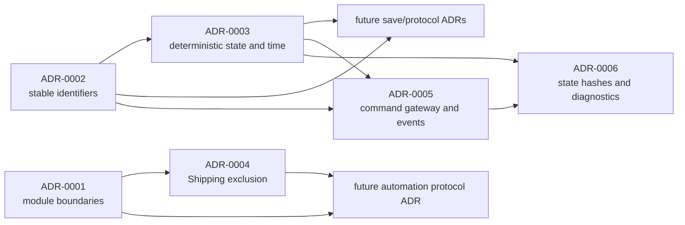

# Hansa Architecture Decision Records

Architecture Decision Records (ADRs) capture durable technical decisions that implementation must follow. They complement [TechnicalArchitecture.md](../../TechnicalArchitecture.md): the architecture document explains the whole target system, while an ADR locks one concrete choice, its tradeoffs, and its compliance checks.

## Status vocabulary

- **Proposed:** under review; implementation must not assume acceptance.
- **Accepted:** active decision for new work.
- **Superseded:** replaced by a later ADR; retained for history.
- **Deprecated:** still present but must not be used for new work.

## Index

| ADR | Status | Decision |
| --- | --- | --- |
| [ADR-0001](0001-module-and-process-boundaries.md) | Accepted | Initial Unreal module and external-process boundaries |
| [ADR-0002](0002-stable-identifiers.md) | Accepted | Stable definition and runtime entity identifiers |
| [ADR-0003](0003-deterministic-units-and-time.md) | Accepted | Fixed-point domain units, simulation time and deterministic ordering |
| [ADR-0004](0004-shipping-exclusion.md) | Accepted | Compile-time and packaging exclusion of editor, automation, test and generation tooling |
| [ADR-0005](0005-command-gateway-and-domain-events.md) | Accepted | Single typed transactional command gateway and ordered domain-event publication |
| [ADR-0006](0006-normalized-state-hashes-and-diagnostics.md) | Accepted | Versioned normalized subsystem hashes and first-divergence diagnostics |

## ADR rules

1. Use the next four-digit number and a short kebab-case filename.
2. Record context, decision, consequences, compliance evidence and deferred choices.
3. Do not edit an accepted ADR to reverse its decision. Add a superseding ADR and link both records.
4. Clarifications that do not change the decision may be added with a dated amendment.
5. Code review must identify the ADR when changing a locked boundary or invariant.
6. An accepted decision without an executable check remains implementation debt and must be listed as such in the development baseline.

## Initial decision dependency

The audited implementation status for these decisions is maintained in [Development/Baseline.md](../../Development/Baseline.md).
