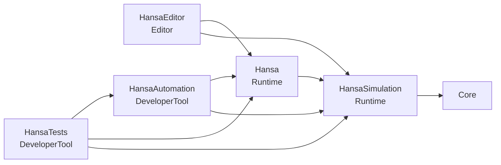
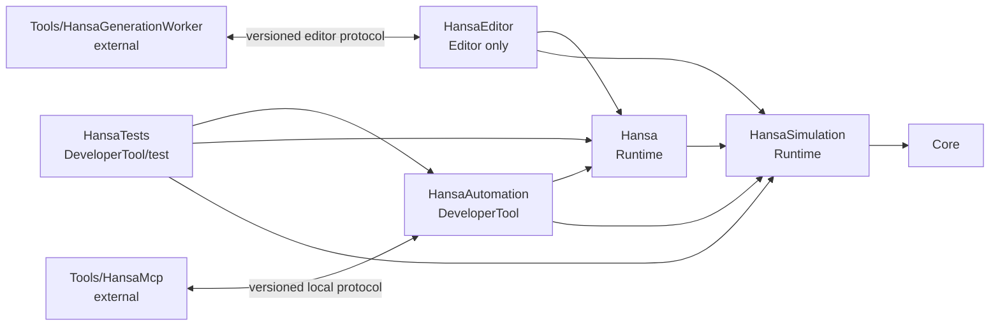

# Hansa — Development Baseline

- Audit date: 2026-09-01
- Last verification update: `S01-P04`, 2026-09-02
- Sprint tasks covered: `S00-P01`, `S00-P02`, `S00-P03`, `S00-P04`, `S01-P01`, `S01-P02`, `S01-P03`, `S01-P04`
- Audited branch: `main`
- Audited commit: `9375951` (`Initial Unreal Engine project setup`)
- Project: Unreal Engine 5.8 C++ project on Windows

## 1. Purpose

This report separates the repository's verified current state from the target architecture in [TechnicalArchitecture.md](../TechnicalArchitecture.md). Sprint 0 and Sprint 1 through `S01-P04` are complete and this is the handoff baseline for `S02-P01`. Module shells, architecture smoke tests, repeatable build/test/audit entry points, repository conventions, source/configuration release guardrails, deterministic domain primitives, authoritative state, fixed-step pipeline, read-only projections/diffs, typed commands, ordered domain events, normalized hashes and named headless fixtures are implemented; later gameplay definitions, editor studio, automation transport, external tools, real content validation, packaging, and release gates are still plans.

The workspace was intentionally left dirty. At audit start, `README.md` was modified and `AGENTS.md` plus `Docs/` were untracked. These are user/project documentation changes and must not be reset or overwritten.

## 2. Verified toolchain

| Item | Verified state |
| --- | --- |
| Project engine association | `5.8` in `Hansa.uproject` |
| Installed engine used | UE 5.8.2, changelist `56702186`, under `H:\Unreal\UE_5.8` |
| Unreal build toolchain | Visual Studio 2022 Professional toolchain, MSVC `14.44.35228`/tools `14.44.35207` |
| Windows SDK selected by UBT | `10.0.22621.0` |
| Other installed IDEs | VS 2019 Build Tools, VS 2022 Community, VS 2026 Professional |
| Git remote | `origin` → `https://github.com/johdav999/Hansa.git` |
| Git LFS | Installed, version `3.5.1`; no LFS objects are currently tracked |
| Build settings | `BuildSettingsVersion.V7` in both targets |

The checked-in `.vsconfig` requests the native-game workload and UE-selected Visual Studio 2022 compiler/SDK components. UBT selected Visual Studio 2022 for compilation, but its automatic project-file generator selected the separately installed Visual Studio 2026 and produced `ToolsVersion="18.0"`/`v145` files that Visual Studio 2022 could not load. A command-line-only `-2022` fix was insufficient because Unreal Editor and Explorer regeneration do not inherit that option. The source-controlled project-scoped `Saved/UnrealBuildTool/BuildConfiguration.xml` now pins `VisualStudio2022` for every regeneration path; `GenerateProjectFiles.ps1` and the repository convention audit verify the persistent setting plus solution/project/toolset markers. Project generation must not assume that UBT's compile-toolchain choice and newest-IDE project format are the same decision.

## 3. Build verification

The following targets were built with the installed UE 5.8 engine on 2026-09-01:

| Target | Platform/configuration | Result | Notes |
| --- | --- | --- | --- |
| `HansaEditor` | Win64 Development | Pass | Compiled all five project modules and linked their Editor DLLs |
| `Hansa` | Win64 Development | Pass | Compiled runtime, automation and test modules into `Binaries/Win64/Hansa.exe`; no Editor module |
| `Hansa` | Win64 Shipping | Pass | Compiled only runtime modules into `Binaries/Win64/Hansa-Win64-Shipping.exe` |

Both targets explicitly select `EngineIncludeOrderVersion.Unreal5_8`; all three builds completed without the previous Unreal 5.6-compatible include-order warning.

The two tests under `Hansa.Architecture.Modules` passed headlessly. The Shipping receipt and executable contained none of `HansaAutomation`, `HansaEditor`, `HansaTests`, or `WITH_HANSA_AUTOMATION`. This proves target-level exclusion, not yet cook/package/depot exclusion.

`Scripts/InvokeCI.ps1 -TestFilter Hansa` was also verified end to end using automatic UE 5.8 discovery. It built Development Editor, ran both tests, built the Development game, built Shipping, and completed the target-level exclusion audit. Project generation passed through the UnrealBuildTool fallback used by Launcher installs without `GenerateProjectFiles.bat`; the corrected generation entry point now pins Visual Studio 2022 and fails if Unreal emits incompatible metadata. Logs, hashes, commands, and machine-readable results were retained beneath the ignored `Saved/BuildArtifacts/` tree.

After `S00-P04`, the integrated command passed again on 2026-09-02 with the repository-convention audit as its first gate. The gate checked 51 repository text files for high-confidence secret patterns, verified runtime/config provider separation, confirmed cook and ignore rules, validated representative LFS routing, checked both Unreal test names, and parsed the fixture template before Unreal compilation began.

## 4. Current repository shape

### Unreal descriptors and targets

- `Hansa.uproject` declares `HansaSimulation` and `Hansa` as `Runtime`, `HansaEditor` as `Editor`, and `HansaAutomation` plus `HansaTests` as `DeveloperTool`.
- The only explicitly enabled plugin is `ModelingToolsEditorMode`, allowlisted for Editor targets.
- `Hansa.Target.cs` compiles `HansaAutomation` and developer tools only for non-Shipping configurations. Shipping contains the runtime composition.
- `HansaEditor.Target.cs` explicitly includes the game, editor, automation and test modules.
- Both targets use UE 5.8 include order.
- There is no dedicated server target or separate test target; the proven initial test shape is a `DeveloperTool` project module.
- There is no `Tools/HansaMcp` or `Tools/HansaGenerationWorker` tree.

### C++ source

- `Hansa.cpp` registers the stock primary game module and defines the root `LogHansa` category.
- `HansaSimulation` depends only on `Core` and has a minimal module lifecycle/log category.
- `Hansa` publicly depends on `Core` and `HansaSimulation`; its Engine-facing dependencies are private.
- `HansaEditor` depends one-way on both runtime modules and `UnrealEd` and refuses non-Editor target compilation.
- `HansaAutomation` depends one-way on both runtime modules and refuses Shipping compilation.
- `HansaTests` contains headless loadability, descriptor-host-type and source dependency-boundary tests and refuses Shipping compilation.
- Non-reflected foundation helpers demonstrate the `Hansa::<Area>` namespace convention in automation and test code; UHT-reflected types will retain Unreal's global naming conventions.
- The `Hansa` runtime module still declares no Slate, UMG, Enhanced Input, networking, asset-management, editor, automation, or test dependency.
- The unused `MyClass.h/.cpp` placeholder has been removed.
- No Gameplay Framework subclasses or authored definition assets exist yet. S01-P03 adds transport-neutral typed representative command payloads and immutable domain events without implementing a city feature.
- `HansaSimulation` now owns typed canonical definition IDs, typed runtime entity IDs, checked fixed-point money/quantity/rate arithmetic, versioned tick/calendar values, named deterministic RNG streams and the versioned `HPR1` primitive serializer. The concrete contract is recorded in [DeterministicPrimitives.md](DeterministicPrimitives.md).
- Five headless tests under `Hansa.Simulation.Primitives` cover identity, arithmetic, clock, RNG and serialization behavior. No primitive includes an Actor, UObject, World, editor, automation or provider dependency.
- `HansaSimulation` now also owns the immutable definition context, canonical plain-record simulation state, versioned eleven-phase fixed-step pipeline, rebuildable transient cache, owning snapshots and purpose-built read-only projections documented in [SimulationKernel.md](SimulationKernel.md).
- Five tests under `Hansa.Simulation.Kernel` cover canonicalization, exact phase order, transactional failures, read-only snapshot/projection behavior and 1,000-tick deterministic replay through the sole command gateway.
- `HansaSimulation` now owns the versioned typed command envelope, authority context, structured gateway result, transactional create/cancel/no-op lifecycle payloads and immutable ordered domain events documented in [CommandGateway.md](CommandGateway.md). Four `Hansa.Simulation.Commands` tests cover lifecycle application, rollback, structured validation, caller-origin parity, replay and cross-tick event order.
- `HansaSimulation` now derives fingerprint version 3 from nine versioned normalized subsystem hashes, exposes compact state reports and projection diffs, and owns a named exact-tick fixture/trace/comparison/evidence harness documented in [DeterminismDiagnostics.md](DeterminismDiagnostics.md). Five `Hansa.Simulation.Diagnostics` tests cover normalization/exclusions, projection diffs, golden fixture execution, Saved JSON evidence, first-divergence diagnostics and intentional phase-order drift.
- `Tests/Fixtures/foundation_determinism_v1.json` is the first reviewed runnable descriptor and locks its six-tick final checksum.

### Content and configuration

- `Content/Hansa/` is established as the sole project content root; there are still no project `.uasset` or `.umap` files.
- The game default map is the engine template `/Engine/Maps/Templates/OpenWorld`, not a Hansa-owned map.
- `DefaultInput.ini` selects Enhanced Input base classes, but no project input actions/mapping contexts or C++ `EnhancedInput` dependency exist.
- Rendering defaults enable DX12/SM6, Lumen-style dynamic GI/reflections, ray tracing, distance fields, skin cache, and Substrate. These are template choices, not measured Hansa performance decisions.
- `DefaultEngine.ini` repeats `DefaultGraphicsRHI=DefaultGraphicsRHI_DX12`.
- Android File Server and its network access are disabled in shared config and `SecurityToken` is empty.
- `[Hansa.Project]` records the convention version. `[Hansa.Automation] bEnableTransport=False` is the checked-in development default; `S00-P02` still implements no pipe/socket endpoint.
- `/Game/Hansa/Developer` and `/Game/Hansa/Generated/Staging` are excluded from cook. Generated staging is also ignored by Git, and production references to either development path fail the repository convention audit.
- `Tests/Fixtures/fixture.example.json` documents the deterministic fixture envelope without implementing a domain fixture. No provider configuration or credential path exists in runtime/configuration.

### Git and large files

- Sixteen files were tracked at the audited commit.
- Generated Unreal/IDE directories and solution files are correctly ignored.
- `.gitattributes` routes `.uasset`, `.umap`, common 3D source formats, audio/video formats, and raster image formats including PNG through Git LFS.
- Repository-owned PowerShell entry points under `Scripts/` cover project generation, target builds, headless tests, target-level Shipping exclusion, and the combined local/CI sequence.
- No provider-specific CI workflow exists because no intended CI platform has been selected. The supported platform-neutral runner contract is documented in [BuildAndTest.md](BuildAndTest.md).

## 5. Current dependency diagram



Unreal Build Tool now enforces these module dependency lists. The smoke tests add a fast guard against forbidden source-level reverse dependencies and incorrect `.uproject` host types.

## 6. Accepted and implemented dependency direction

The initial decisions are recorded in the [ADR index](../Architecture/Decisions/README.md). The accepted target shape is:



Forbidden reverse dependencies:

- `HansaSimulation` → `Hansa`, Engine presentation, Slate/UMG, editor, automation, or tools;
- `Hansa` → `HansaEditor`, `HansaAutomation`, `HansaTests`, or external tools;
- any Shipping binary/content → editor, test, automation, provider, staging, or credential artifacts.

## 7. Verification commands

Run from the repository root with PowerShell 7. The scripts discover UE 5.8 automatically where possible; use `-EngineRoot` or `HANSA_UNREAL_ENGINE_ROOT` when an explicit selection is needed. Full options and the CI host contract are in [BuildAndTest.md](BuildAndTest.md).

### Git and LFS

```powershell
git status --short
git remote -v
git lfs version
git lfs status
git check-ignore -v Binaries Intermediate DerivedDataCache Saved .vs Hansa.sln
git check-attr filter diff merge text -- '*.uasset' '*.umap' '*.fbx' '*.wav'
```

Expected now: generated paths are ignored, LFS is available, binary asset patterns have `filter=lfs`, and the documented dirty files remain visible until deliberately committed.

### Supported build, test and audit entry points

```powershell
pwsh -File Scripts/VerifyRepositoryConventions.ps1
pwsh -File Scripts/GenerateProjectFiles.ps1
pwsh -File Scripts/Build.ps1 -Target HansaEditor -Configuration Development
pwsh -File Scripts/Build.ps1 -Target Hansa -Configuration Development
pwsh -File Scripts/RunAutomationTests.ps1 -TestFilter Hansa
pwsh -File Scripts/VerifyShippingExclusion.ps1
pwsh -File Scripts/InvokeCI.ps1 -TestFilter Hansa
```

Expected now: project generation works with both the engine batch entry point and UnrealBuildTool fallback; all current target builds compile with UE 5.8 include order; both architecture tests pass; the Shipping audit excludes representative development markers. Failures return nonzero and retain command output plus normal Unreal logs under ignored evidence directories.

### Gates that do not exist yet

Data Validation has no Hansa definition assets or validators yet. This is the intended command once that content exists:

```powershell
& "$HansaEngineRoot\Engine\Binaries\Win64\UnrealEditor-Cmd.exe" `
  "$HansaProject" -unattended -nop4 -nosplash -NullRHI -run=DataValidation
```

Target-level Shipping exclusion is automated because the forbidden modules exist, compile in Development, and are absent from the Shipping receipt/executable. A later gate must still package Shipping and inspect staged/cooked/depot artifacts.

## 8. Verification checklist

### Proven at S00-P01

- [x] Project descriptor parses and associates with UE 5.8.
- [x] UE 5.8.2 is installed and usable at the audited path.
- [x] `HansaEditor` Win64 Development compiles.
- [x] `Hansa` Win64 Development compiles.
- [x] `Hansa` Win64 Shipping compiles.
- [x] Git remote points to the intended GitHub repository.
- [x] Git LFS is installed and binary Unreal/source-art patterns are configured.
- [x] Generated build/cache/solution paths are ignored.
- [x] Current module/target/config/content gaps are documented.
- [x] Initial architecture decisions and dependency direction are recorded.

### Proven at S00-P02

- [x] `HansaSimulation`, `HansaEditor`, `HansaAutomation`, and `HansaTests` module shells compile with allowed dependencies.
- [x] `HansaAutomation`, `HansaEditor`, and `HansaTests` are absent from Shipping compilation/link paths and representative binary strings.
- [x] UE 5.8 include order is explicitly selected and warning-free.
- [x] Module load, host-type and forbidden-dependency smoke tests exist and pass.
- [x] Headless test entry point runs two named Hansa tests.
- [x] Development automation transport is disabled by default; the current shell opens no endpoint in any mode.

### Proven at S00-P03

- [x] UE 5.8 discovery is configurable, checks required tools and verifies the engine association.
- [x] Project generation, Editor/game builds, headless tests and Shipping exclusion have repository-owned PowerShell entry points.
- [x] The combined local/CI command completes all current gates and propagates meaningful exit codes.
- [x] Missing tools, invalid targets, unsafe test filters, failed native commands, zero tests and missing success evidence fail with actionable messages.
- [x] Normal Unreal logs, command output, hashes and machine-readable results are retained under ignored artifact directories.
- [x] No provider-specific CI configuration was invented before a CI platform was selected; a platform-neutral Windows runner checklist exists.
- [x] Generated project files and Unreal outputs remain untracked.

### Proven at S00-P04

- [x] One canonical document defines C++ ownership/namespaces, content/source-art roots, stable identity namespaces, config sections, log categories, test/fixture naming, and Saved evidence locations.
- [x] Developer content and generated staging are excluded from cook; staging and generated evidence are ignored.
- [x] Checked-in automation remains disabled, Android file-server network access is disabled, and its static token is removed.
- [x] A standalone and CI-integrated convention audit checks high-confidence secrets, runtime provider leakage, production staging references, safe config, ignore/LFS rules, test names, and the fixture template.
- [x] Lightweight content-root, source-art, test-data, and fixture examples exist without implementing a domain feature.
- [x] PNG and other raster project assets are routed through Git LFS.
- [x] README setup/build/test instructions and sprint/convention links match the verified workflow.

### Proven at S01-P01

- [x] Canonical definition IDs and numeric runtime entity IDs are distinct typed wrappers with deterministic ordering and structured invalid-input results.
- [x] Money, milli-unit quantities and ppm rates use checked integer operations with explicit rounding and no authoritative floating-point calculation.
- [x] Simulation version, tick, duration, clock and calendar projection reject invalid ranges and report overflow.
- [x] Named `SplitMix64V1` streams reproduce identical sequences and persist algorithm, state and draw count.
- [x] The `HPR1` format round-trips every primitive and rejects version, type, truncation and trailing-data errors.
- [x] `HansaEditor` Development and `Hansa` Shipping compile; all five focused primitive tests and the full seven-test `Hansa` filter pass headlessly.
- [x] The repository convention audit passes with the new source, tests and documentation.

### Proven at S01-P02

- [x] Immutable definition identity and mutable authoritative records are separate plain C++ boundaries.
- [x] State initialization canonicalizes every result-affecting collection and rejects duplicate IDs, invalid ranges and missing entity references.
- [x] Pipeline version 1 executes eleven named phases in a fixed inspected order and advances exactly one tick per successful step.
- [x] Wrong command tick/order, count overflow and clock overflow fail before authoritative mutation.
- [x] Transient cache data is rebuildable and excluded from snapshots, projections and fingerprints.
- [x] Live const access, owning snapshots and purpose-built projections expose no mutable authoritative container.
- [x] Equal initial state, definition hash, seed and accepted command stream retain equal fingerprints at every step across a 1,000-tick test.

### Proven at S01-P03

- [x] Every state-changing tick enters through one transport-neutral typed gameplay command gateway; the pipeline executor is not a public bypass.
- [x] Commands carry versioned typed payloads, monotonic stable identity, issuing-house/principal/origin authority context, requested tick and deterministic global sequence.
- [x] Player, AI, multiplayer RPC and controlled automation origins share the same authoritative validation and application path.
- [x] Stable structured results distinguish schema, identity, authority, tick, order, capacity, payload, existence, ownership and clock failures.
- [x] Tick batches apply to a working state copy; any late failure preserves state, time, fingerprint and transient cache and publishes no events.
- [x] Successful commands emit immutable globally ordered events correlated to command ID, house and tick.
- [x] Equal typed streams replay to equal per-tick fingerprints and event order; a one-field payload difference diverges.
- [x] The runtime command/event model adds no authored definition property, so no editor schema or migration surface is applicable in this prompt.

### Proven at S01-P04

- [x] Hash format, normalization and global fingerprint versions are explicit; the global fingerprint is derived from one fixed ordered subsystem report.
- [x] Included authoritative fields and excluded transient/presentation/evidence fields are recorded in ADR-0006 and executable tests.
- [x] Nine domain-separated component hashes identify contract, metadata, random stream and entity-record divergence.
- [x] Read-only projection comparison produces stable field/value entries and bounded compact summaries without mutation access.
- [x] A validated named descriptor initializes a headless state and advances an exact bounded tick count exclusively through the normal command gateway.
- [x] Per-tick traces record pipeline order, domain-event order and state-after-tick components.
- [x] Trace comparison stops at the first mismatch and identifies pipeline, events or the relevant authoritative state subsystem.
- [x] `foundation_determinism_v1` locks its final checksum and writes parseable versioned run/divergence JSON under ignored `Saved/TestEvidence`.
- [x] Tests intentionally alter the phase order fingerprint and report the first affected tick.

### Sprint 0 exit status

- [x] Development Editor and game targets build from documented repository entry points.
- [x] Module smoke tests pass headlessly.
- [x] Target-level Shipping exclusion is executable and passing.
- [x] ADRs and repository conventions resolve the contracts required by Sprint 1.

### Deferred gates owned by later feature/release prompts

- [ ] Data Validation gains real Hansa definitions/assets and validators with `S02-P01` and later content prompts.
- [ ] Shipping packaging, staged/cooked/depot inspection, and the disabled-endpoint launch probe are automated before release.

## 9. Unresolved decisions and risks

| Item | Why unresolved | Owner prompt/ADR |
| --- | --- | --- |
| Automation transport/authentication | Named pipe versus loopback and token lifecycle require a focused threat/contract decision | Later automation ADR, before `S02-P02` |
| Test/CI host platform | No CI platform is selected; the scripts and checklist are deliberately platform-neutral | Select when hosted CI is introduced |
| Server target timing | Required architecture, but not part of the immediate module-shell prompt | Before multiplayer implementation |
| Definition asset identity redirects | Stable ID rules are accepted; exact redirect registry/storage lands with definitions | `S02-P01` |
| Rendering feature budget | Current ray tracing/Substrate settings are template defaults without measurements | Performance baseline before art scale-up |
| Full binary asset referencer audit | No production `.uasset` exists yet, so the current gate can enforce path/config policy but not real Asset Registry references | First real content plus packaged release gate |

## 10. Next prompt

`S02-P01 — Definition base, schema registry and generic editor shell` is unblocked. It must introduce the first reflected authoring definition, derive generic editor/schema coverage from metadata, and enforce the complete editor/game parity contract in `Docs/EditorArchitecture.md` and `Docs/EditorMVP.md`.
