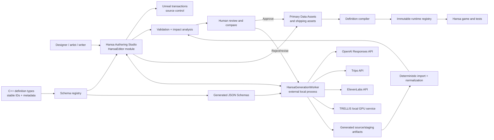

# Hansa — Editor and AI-Assisted Authoring Architecture

## 1. Purpose

This document defines the approach for a first-class Hansa authoring environment inside Unreal Editor. It covers:

- editing goods, recipes, buildings, population needs, cities, research, events, dialogue, audio, and other game definitions;
- graph-based editing for production chains, research, dialogue, dependencies, and route/scenario logic;
- AI-assisted generation of structured game data through the OpenAI API;
- 3D generation through TRELLIS and Tripo provider adapters;
- rigging, skeleton validation, animation generation/retargeting, and Unreal import;
- sound-effect, speech, and multi-speaker dialogue generation through ElevenLabs;
- validation, provenance, cost control, review, source control, migration, and promotion into shipping content;
- keeping editor capabilities and data schemas synchronized with gameplay development.

The editor is an internal production tool. None of its UI, provider integrations, API credentials, staging data, or generation workers ship with the released game.

## 2. Core principles

1. **Authoring evolves with gameplay.** A gameplay feature or data-model change is incomplete until its editor schema, validation, migration, import/export, tests, and relevant AI authoring support are updated in the same change.
2. **Game schemas own the truth.** C++ definition types and stable IDs define valid game data. Editor forms and AI schemas are derived from those contracts rather than maintained as independent copies.
3. **AI proposes; deterministic code validates.** Generated output is an editable draft. It cannot bypass type checking, domain validation, asset budgets, licensing review, or human approval.
4. **Providers are replaceable.** OpenAI, TRELLIS, Tripo, ElevenLabs, and future services sit behind capability-based adapters. No Hansa asset or definition depends on one provider's task format.
5. **Generated work enters staging.** A successful API response is not a production asset. Import, normalization, QA, comparison, approval, and promotion are explicit states.
6. **All work is reproducible.** Store prompt, provider, model/version, seed where available, inputs, settings, output hashes, cost, license/provenance, validation results, and reviewer decision.
7. **Heavy and remote work stays out of Unreal's process.** Unreal owns authoring and previews; a local worker owns credentials, network calls, downloads, conversion helpers, and local GPU inference.
8. **No hidden destructive writes.** All editor changes use Unreal transactions, show a field/asset diff, preserve stable IDs, and support cancel/revert before save.
9. **Text and graph views agree.** A definition has one typed model even when presented as a table, details form, dependency graph, or AI-assisted bulk operation.
10. **The release game has zero dependency.** Runtime modules never depend on editor or generation modules, and Shipping validation proves their absence.

## 3. High-level architecture



The boundaries are intentional:

- `HansaSimulation` owns domain types, stable IDs, compiled runtime definitions, and domain validation that can run without the editor.
- `Hansa` owns Unreal runtime assets and presentation references.
- `HansaEditor` owns authoring UI, editor extensions, asset transactions, import, validation presentation, and promotion.
- `HansaGenerationWorker` owns provider adapters and long-running generation work.
- Generated artifacts remain outside final content paths until approved.

## 4. Unreal module and process strategy

### 4.1 `HansaEditor` module

`HansaEditor` is a separate Unreal module with host type `Editor`. It may depend on `Hansa` and `HansaSimulation`; neither runtime module may depend on it.

Initial responsibilities:

- Hansa Authoring Studio tab and workspace layout;
- definition schema registry and generated editor descriptors;
- generic grid/details authoring;
- production-chain and research graph editors;
- asset factories, importers, reimporters, and promotion actions;
- Data Validation integration and impact analysis;
- source-control status, checkout, save, transaction, and conflict guidance;
- generation-job UI and local-worker client;
- asset preview scenes and before/after comparison;
- provenance, cost, rights, and approval records.

Start with one cohesive editor module. Extract `HansaGenerationEditor` or specialized graph modules only when dependencies or build times justify it.

### 4.2 `HansaGenerationWorker`

Place the external worker under `Tools/HansaGenerationWorker/`. It is a local development tool, not an Unreal module and not part of packaged builds.

Responsibilities:

- provider authentication and secure credential lookup;
- capability discovery and pinned provider/model versions;
- asynchronous submission, polling/webhooks, retry, cancellation, and timeout;
- local TRELLIS environment/GPU orchestration;
- remote Tripo, ElevenLabs, and OpenAI calls;
- resumable download and content hashing;
- conversion in isolated temporary workspaces;
- usage/cost capture and budget enforcement;
- immutable job manifests and structured logs;
- returning artifacts to editor-owned staging paths.

Use a versioned local protocol over a named pipe by default. A loopback HTTP/WebSocket transport is acceptable when required by a provider callback or cross-platform worker, but must be opt-in and authenticated. The Unreal Editor should survive a worker crash or restart without losing saved job state.

### 4.3 Provider adapter contract

The worker exposes a provider-neutral interface:

```text
IHansaGenerationProvider
├── GetCapabilities()
├── ValidateRequest(request)
├── EstimateCost(request)
├── Submit(request) -> providerJobId
├── Poll(providerJobId) -> progress/result
├── Cancel(providerJobId)
├── Download(result) -> stagedArtifacts
└── NormalizeMetadata(result) -> provenance
```

Capabilities, not provider names, drive the editor:

- `StructuredDataDraft`
- `TextToMesh`, `ImageToMesh`, `MultiViewToMesh`, `MeshVariation`
- `TextureGeneration`, `Retopology`, `Segmentation`
- `RigCheck`, `AutoRig`, `AnimationPreset`, `AnimationRetarget`
- `TextToSpeech`, `TextToDialogue`, `TextToSoundEffect`

If a provider removes or changes a capability, the corresponding editor action becomes unavailable with an explanation; saved Hansa definitions and approved assets remain valid.

## 5. Hansa Authoring Studio UX

The editor UI follows `Docs/UIDesignBrief.md` and `Docs/UIAssetWorkflow.md` for readability, accessibility, component construction, and native-resolution media handling. It may be denser and more utilitarian than the player UI, but uses the same semantic color and status language.

### 5.1 Workspace layout

```text
┌ Toolbar: domain | search | validate | generate | compare | save ─────────────┐
│ Definition browser │ Main editor                          │ Inspector          │
│ filters / sets     │ table, form, graph, preview          │ fields / references│
│                    │                                      │ validation / impact│
├────────────────────┴──────────────────────────────────────┴───────────────────┤
│ Jobs / diagnostics / provenance / source control / generated diff            │
└───────────────────────────────────────────────────────────────────────────────┘
```

Core workspaces:

- **Data:** grid, bulk edit, details, references, localization, import/export;
- **Production:** recipe flow graph, throughput ratios, goods availability, building links;
- **Research:** prerequisite graph, unlock effects, exclusive branches, reachability;
- **World:** city/region definitions, resources, modifiers, map-node references;
- **Narrative:** events, dialogue lines, speakers, conditions, localization, audio takes;
- **Assets:** meshes, skeletons, animations, textures, audio, budgets, dependency use;
- **Generation:** prompt/request builder, provider choice, queue, cost, variants, compare;
- **Validation:** errors, warnings, affected scenarios/saves, fix actions, CI parity;
- **History:** provenance, revisions, approvals, migrations, and source-control state.

### 5.2 Usability rules

- Every error identifies the invalid field, cause, affected content, and possible remedy.
- Graph selection and details selection remain synchronized.
- Bulk operations preview affected assets and values before applying.
- Long jobs never block the editor thread; jobs survive tab closure and editor restart.
- Keyboard navigation, search, filter presets, multi-select, undo/redo, and source-control status are first-class.
- Generated and manually authored values are visually distinguishable through provenance badges, not color alone.
- The editor never silently replaces a manually reviewed field with a regenerated value.
- Provider-specific advanced settings live behind an expandable panel; normal authoring begins with Hansa-level intent and budgets.

## 6. Schema-driven data editing

### 6.1 Authoritative schema

Continue to use C++ `UPrimaryDataAsset` subclasses and typed `USTRUCT` value objects as the authoritative authoring schema. Introduce a common base such as `UHansaDefinitionBase` with:

- stable definition ID;
- schema version;
- display/localization identity;
- authored revision;
- tags and content set;
- deprecation/replacement metadata;
- deterministic content hash;
- validation and migration hooks.

Unreal assets remain the source of truth for accepted content. JSON is an interchange, review, and AI-generation format—not a second independently editable source of truth.

### 6.2 Schema registry

`FHansaEditorSchemaRegistry` discovers all supported `UHansaDefinitionBase` subclasses and reflected properties at editor startup or commandlet execution. It produces:

- generic table columns and Details-panel fields;
- field categories, units, ranges, defaults, tooltips, and reference pickers;
- stable machine paths for diff and patch operations;
- JSON Schema for OpenAI structured output and external tooling;
- validation coverage and missing-metadata diagnostics;
- editor-extension points for custom visualizations.

Use C++/UPROPERTY metadata to describe authoring behavior rather than writing duplicate editor forms. Project-specific metadata can express concepts such as:

```text
HansaStableId
HansaUnit="Pfennig"
HansaReference="Good"
HansaMin="0"
HansaAIAccess="Suggest"
HansaBulkEditable
HansaRequiresMigration
HansaEditorGroup="Market"
```

AI access is explicit per field:

- `Never`: secrets, derived hashes, internal classes, or values that must be coded;
- `Read`: available as context but cannot be proposed as a change;
- `Suggest`: may appear in a reviewed AI patch;
- `Generate`: may be populated in a new draft definition.

A new reflected field appears automatically in the generic details editor. CI fails if it lacks required authoring metadata, validation classification, serialization coverage, and AI-access classification. Custom screens therefore cannot silently fall behind the runtime model.

### 6.3 Specialized editor extensions

Generic reflection provides a correct fallback. Rich domain views implement `IHansaDefinitionEditorExtension`:

```text
CanEdit(definitionClass)
BuildColumns(schema)
BuildDetails(schema)
BuildGraph(schema, selection)
ValidateEditorState(definitions)
ContributePromptContext(definitions)
ContributeImpactAnalysis(changeSet)
```

Initial extensions:

- goods and market behavior;
- recipes and production graphs;
- buildings and footprint/placement previews;
- population needs and supportable-residence calculations;
- technologies and research dependencies;
- cities/regions and resource availability;
- events, conditions, effects, and dialogue;
- victory definitions and progress queries.

When a custom extension has not yet adopted a new property, the property still appears in the generic inspector and the editor displays an explicit extension-coverage warning.

## 7. Data lifecycle, versioning, and migration

```text
Create or open definition
  → edit through transaction
  → local field validation
  → cross-definition validation
  → impact analysis
  → preview compiled registry
  → save/source control
  → CI validation and deterministic compile
  → cook shipping content
```

Each breaking schema change adds a migration from version N to N+1. Migration must cover:

- existing Data Assets;
- JSON interchange documents and saved AI drafts;
- deterministic fixtures and golden scenarios;
- definition ID redirects;
- saved generation job requests that reference old fields;
- custom graph-node presentation state where applicable.

Migrations run first in dry-run mode and show a diff. They use `FScopedTransaction` when applied interactively and a deterministic commandlet in CI. Never infer a renamed stable ID from display text.

## 8. Change-impact analysis

Before save or promotion, the editor shows downstream effects:

- definitions and scenarios referencing the changed object;
- affected production ratios and population support calculations;
- research nodes made unreachable or newly unlocked;
- assets requiring reimport or regeneration;
- fixtures and tests whose content hash changed;
- saves requiring a migration or definition redirect;
- localization entries added, removed, or invalidated;
- multiplayer definition hash changes;
- estimated cook/package impact.

The first version may use Asset Registry references plus the compiled definition graph. Later, cache a dependency index for interactive performance.

## 9. OpenAI-assisted game-data authoring

### 9.1 Role

Use the OpenAI Responses API as a structured drafting and review assistant for:

- new goods, recipes, buildings, needs, technologies, events, contracts, and cities;
- balanced variants constrained by existing content and target ratios;
- descriptions, tooltips, localization drafts, dialogue scripts, and historical research questions;
- gap analysis, duplicate detection, prerequisite suggestions, and consistency review;
- migration suggestions and test-case proposals.

The API can accept text/image/file inputs, produce structured JSON, and call typed custom tools; Hansa should use strict generated schemas and narrowly scoped tools rather than free-form JSON. See the [official OpenAI Responses API reference](https://developers.openai.com/api/reference/cli/resources/responses/methods/create).

### 9.2 Request construction

The worker sends only the minimum required context:

- generated JSON Schema for the requested definition or patch;
- stable IDs and compact summaries of allowed references;
- relevant balance targets and invariants;
- selected existing definitions, not the whole project by default;
- exact requested language and historical period constraints;
- project style/writing rules where text is generated;
- explicit prohibited fields and operations;
- a request ID, schema version, base revision, and content hash.

Historical claims should cite project-approved source IDs when source-grounded generation is requested. A model's unsupported historical assertion remains a draft requiring review.

### 9.3 Patch format

AI output never writes arbitrary asset JSON. It returns a typed proposal:

```json
{
  "schemaId": "Hansa.GoodDefinition",
  "schemaVersion": 3,
  "baseDefinitionId": "Good.Grain",
  "baseRevision": 17,
  "changes": [
    {
      "operation": "set",
      "path": "Market.Elasticity",
      "value": 1250,
      "unit": "FixedPoint1e4",
      "reason": "Staple demand should react strongly to scarcity."
    }
  ],
  "assumptions": [],
  "sourceRefs": []
}
```

The editor rejects unknown properties, stale base revisions, illegal references, wrong units, out-of-range values, derived fields, and disallowed AI access. Valid proposals receive a field-by-field diff and can be accepted selectively in one undoable transaction.

### 9.4 Balance sandbox

Do not ask an LLM to declare content “balanced” from prose alone. For every proposed economic patch:

1. compile a temporary definition registry;
2. run recipe conservation, reachability, affordability, and ratio checks;
3. run selected deterministic fixtures or balance simulations;
4. compare metrics against the current baseline;
5. show measured effects beside the AI rationale;
6. require approval before saving.

OpenAI may explain results and propose another patch, but deterministic simulation determines whether invariants pass.

## 10. Generation job model

Persist every request as an `FHansaGenerationJob`-equivalent document:

```text
JobId and parent/revision
Capability and intended asset role
Provider and pinned model/version
Prompt plus negative prompt/direction
Input artifact hashes and rights declarations
Requested budgets and output contract
Seed and provider parameters where available
Status, progress, timestamps, retry lineage
Estimated and actual cost/usage
Raw provider task IDs and normalized errors
Output artifact hashes and manifest
Automated QA results
Reviewer, decision, destination, and promoted revision
```

State machine:

```text
Draft → Estimated → ApprovedToSpend → Queued → Running → Downloading
      → ImportedToStaging → Validating → Review
      → Approved → Promoted
      → Rejected / RevisionRequested / Failed / Cancelled / Expired
```

Approval to spend and approval to promote are separate decisions.

## 11. 3D asset pipeline

### 11.1 Provider roles

- **TRELLIS adapter:** local or studio-hosted image/text-conditioned 3D generation, useful where local control and reproducibility are preferred. The official project supports text/image prompts and mesh output, but its environment and GPU requirements should be isolated behind the worker rather than embedded into Unreal. See the [official Microsoft TRELLIS repository](https://github.com/microsoft/TRELLIS).
- **Tripo adapter:** remote text-to-model, image-to-model, multi-view, texture, retopology, rigging, and animation capabilities. Tripo generation is asynchronous, so the adapter persists task IDs and resumes polling/webhook processing after restart. See the [official Tripo developer documentation](https://developers.tripo3d.ai/en/).

Do not assume that all providers produce interchangeable quality. Save Hansa-level output requirements and let each adapter translate them into supported provider parameters.

### 11.2 Asset-class contract

Each intended asset role defines a checked profile, for example:

- building hero, building background, prop, vehicle, citizen, animal;
- static versus skeletal;
- world scale and real dimensions;
- origin, pivot, forward/up axes, and placement socket requirements;
- triangle/vertex budgets by LOD or Nanite policy;
- material slot count, shader model, and texture channel packing;
- UV requirements, lightmap policy, texel density, and texture dimensions;
- collision, navigation, occlusion, and destructibility needs;
- modular snapping dimensions and silhouette constraints;
- skeleton profile and required animation set;
- historical/art-direction tags and disallowed motifs.

The profile is stored independently of the provider. Generation requests and automated QA use the same profile.

### 11.3 Staged 3D workflow

```text
Brief/reference approval
  → provider variants
  → isolated source download
  → malware/file/format checks
  → scale/axis/pivot normalization
  → mesh/material/texture inspection
  → retopology or decimation if needed
  → UV/PBR validation
  → collision and LOD/Nanite preparation
  → skeleton/animation pipeline if needed
  → Unreal staging import
  → automated budget and render tests
  → human 3D review in standard preview scene
  → promotion to final asset path
```

Never import provider output directly over a production asset. Variants are siblings with immutable source hashes. Revisions can deliberately replace a final asset only through a reimport/promotion action that shows referencers and diffs.

### 11.4 Review scenes

Provide deterministic Unreal preview scenes for:

- neutral studio lighting and material channels;
- Hansa daylight, overcast, dusk, snow, and rain;
- silhouette and distance/LOD comparison;
- modular placement and adjacent-building seams;
- collision, navigation, pivot, sockets, and scale references;
- animation deformation and root-motion inspection.

Capture native-resolution evidence through the `HansaAutomation` screenshot service so the generation job retains both structured QA and visual review evidence.

## 12. Skeleton, rigging, and animation pipeline

### 12.1 Canonical skeleton profiles

Hansa owns canonical skeleton profiles rather than accepting arbitrary provider rigs as runtime contracts:

- human adult base skeleton;
- optional body/garment variants sharing compatible bone contracts;
- horse and other approved animal profiles;
- vehicle/mechanical rigs where useful.

Each profile defines bone names, hierarchy, orientation, required bones, root-motion policy, scale, retarget pose, sockets, physics expectations, and allowed optional bones.

### 12.2 Pipeline

1. Classify mesh and run provider-neutral rig suitability checks.
2. Use Tripo rig-check/auto-rig or another future rig provider when appropriate.
3. Import only into staging and validate influences, missing/extra bones, orientation, bind pose, weights, and deformation.
4. Map the provider rig to the Hansa canonical profile.
5. Retarget or generate clips into Hansa-owned animation assets.
6. Run foot sliding, root motion, loop continuity, penetration, pose range, and performance checks.
7. Preview at game speed with representative clothing, equipment, and LODs.
8. Approve animation clips separately from mesh/rig approval.

Tripo currently exposes automated rigging and game-oriented output formats; its adapter must still normalize results to Hansa skeleton contracts. See [Tripo auto-rigging documentation](https://developers.tripo3d.ai/en/docs/animations-rig).

### 12.3 Animation data

Use stable animation-purpose IDs such as:

```text
Human.Locomotion.Walk.CarryLight
Human.Work.Dock.LoadBarrel
Human.Work.Smith.Hammer
Human.Social.Market.Bargain
Horse.Locomotion.Trot.PullCart
```

Gameplay references purpose IDs through an animation set, not provider filenames. This permits replacing clips or providers without changing simulation/gameplay definitions.

## 13. Audio, sound-effect, and dialogue pipeline

### 13.1 Data model

Separate narrative intent from generated audio:

```text
DialogueLine
├── stable line ID
├── speaker/voice-casting role
├── source text and localization key
├── scene/context and addressee
├── delivery direction and allowed tags
├── pronunciation entries
├── subtitle/caption text
├── gameplay conditions and priority
└── approved audio-take references by locale

AudioTake
├── line/SFX ID and locale
├── provider voice/model/settings
├── seed where supported
├── generated file hash
├── duration and measured loudness
├── transcript/alignment
├── rights/provenance
└── approval status
```

Changing generated audio never changes the stable dialogue line or gameplay condition.

### 13.2 ElevenLabs capabilities

The ElevenLabs adapter supports:

- individual speech/voice lines;
- multi-speaker text-to-dialogue variants;
- UI, environment, work, harbor, weather, and event sound effects;
- pronunciation dictionaries and locale-specific takes where supported;
- explicit output-format selection appropriate for the Unreal import pipeline.

ElevenLabs documents both [text-to-dialogue](https://elevenlabs.io/docs/api-reference/text-to-dialogue/convert) and [text-to-sound-effects](https://elevenlabs.io/docs/api-reference/text-to-sound-effects/convert) endpoints. Treat provider seed behavior as best-effort rather than guaranteed audio determinism; the approved output file hash is the reproducible artifact.

### 13.3 Audio QA and promotion

Automated checks:

- decodable format, channel count, sample rate, bit depth, and duration;
- silence at head/tail, clipping, DC offset, peak and loudness range;
- loop-boundary continuity for looping ambience/SFX;
- transcript/subtitle agreement and missing-line detection;
- prohibited unexpected speech in SFX;
- duplicate/near-duplicate asset detection;
- expected locale, speaker, line ID, and pronunciation coverage;
- memory/compression budget and concurrency category.

Human review covers intelligibility, performance, period/tone suitability, emotional direction, artifacts, repetition fatigue, and fit in a representative gameplay mix. Voice cloning or a recognizable voice requires documented rights and consent; the tool must not treat possession of a sample as permission.

## 14. Staging, promotion, and asset paths

```text
Saved/GenerationJobs/<JobId>/                 transient resumable state; ignored
SourceArt/Generated/<Domain>/<JobId>/         selected immutable source artifacts + manifest
Content/Hansa/Generated/Staging/<JobId>/      Unreal staging imports; never referenced by shipping content
Content/Hansa/<Domain>/<Feature>/             approved production assets
Content/Hansa/Developer/GenerationPreview/    preview scenes/materials; not shipped
```

Promotion performs an atomic editor transaction:

1. verify job manifest, hashes, rights, provider/model, and reviewer;
2. rerun applicable validators and render/audio checks;
3. resolve the final naming/path policy;
4. detect collisions and show existing referencers;
5. create or deliberately reimport the production asset;
6. update approved definition references;
7. save provenance as asset metadata and a text manifest;
8. add/update source-control files;
9. run targeted cook/reference validation;
10. mark staging artifact promoted without deleting its provenance.

Generated staging paths must be excluded from shipping cooks. Shipping content must never reference a staging asset.

## 15. Validation framework

### 15.1 Definition validation

- type, range, units, stable ID, and required fields;
- reference existence, allowed class, deprecation, and content-set availability;
- recipe conservation and declared sources/sinks;
- production/research/event graph reachability and cycle rules;
- scenario availability and localization completeness;
- deterministic registry compilation and hash stability;
- save/fixture migration coverage.

### 15.2 Media validation

- file safety and supported formats;
- asset-class geometry, texture, material, rig, animation, and audio budgets;
- scale, axes, pivot, naming, folder, dependency, and import settings;
- missing LOD/collision/socket/UV requirements;
- no staging or provider URLs in production references;
- complete provenance and commercial-use review.

### 15.3 AI proposal validation

- exact schema and version match;
- allowed fields/operations only;
- base revision and content hash still current;
- every reference resolves through stable IDs;
- no generated code, class names, paths, URLs, or executable commands in data fields unless that field explicitly permits them;
- deterministic domain tests and balance sandbox pass;
- reviewer approves the actual diff, not only the prompt.

## 16. Editor/game feature-parity contract

Every new or changed gameplay data model must satisfy this matrix in the same implementation stream:

| Game change | Required editor change |
| --- | --- |
| New definition class | Schema registration, generic editor support, category/search, create/duplicate actions, import/export schema |
| New property | Metadata, field presentation, units/range/default, AI-access classification, diff/patch support |
| Changed semantics | Tooltip/help, validation, impact analysis, migration, updated prompt context |
| New stable reference | Reference picker, reverse-reference lookup, deletion/redirect rules |
| New graph relationship | Generic dependency visibility and specialized graph support where needed |
| New runtime invariant | Editor validator, commandlet test, actionable diagnostic |
| New player-facing asset reference | Preview, picker/filter, missing-asset validation, staging/promotion support |
| New AI-generatable content | Capability/request schema, budget profile, provenance, QA, mocked provider test |
| Removed/renamed field or definition | Migration, redirect, saved-draft/job compatibility, fixture update |
| New feature UI | Semantic automation support and deterministic editor/game fixture as applicable |

Definition of done:

1. generic editor coverage passes automatically;
2. specialized view coverage is updated or an explicit warning/approved follow-up exists;
3. old content migrates in dry-run and applied modes;
4. OpenAI schema exports and AI-access policy are current;
5. fixtures, validators, compiled registry, and impact analysis pass;
6. provider mock tests pass when generation is involved;
7. documentation and examples use the new schema;
8. Shipping exclusion remains proven.

## 17. Testing and CI

### Fast tests

- schema discovery and metadata completeness;
- JSON Schema generation/golden comparisons;
- patch validation and transaction rollback;
- migrations and stable ID redirects;
- graph reachability and cross-reference indexes;
- job state-machine transitions and idempotency;
- provider adapters against recorded/mock responses;
- manifest hashing, retry, resume, and cancellation;
- importer normalization and asset-budget validation.

### Unreal integration tests

- create/edit/save/reload one asset of every definition type;
- generic editor renders every editable property;
- graph and details views remain synchronized;
- undo/redo and multi-asset bulk edit preserve data;
- worker disconnect/reconnect and editor restart resume jobs safely;
- staged assets cannot be referenced by shipping content;
- promotion is atomic and records provenance;
- standard preview scenes and native-resolution screenshots render correctly.

### CI gates

1. Build game, editor, automation, and tests.
2. Export schemas and fail on unexpected or unreviewed schema changes.
3. Run metadata coverage, validation, migration, and compiled-registry tests.
4. Run provider contract tests only against mocks/recordings; normal CI must not spend credits.
5. Run import/QA tests on small golden mesh, rig, animation, and audio artifacts.
6. Verify no secrets, raw provider credentials, temporary downloads, or unapproved generated artifacts are tracked.
7. Verify no production asset references `/Generated/Staging/` or `/Developer/`.
8. Cook/package Shipping and prove editor modules, workers, credentials, staging assets, and generation configuration are absent.

Live provider smoke tests run manually or on a scheduled, explicitly budgeted pipeline with dedicated low-privilege credentials.

## 18. Security, privacy, cost, and rights

- Store provider credentials in the operating-system credential store or injected worker environment, never source, `.ini`, Data Assets, Blueprint defaults, logs, or job manifests.
- Use separate provider projects/keys for development and CI smoke tests, with spend limits and revocation procedures.
- Redact authorization headers, signed URLs, user identifiers, and private source material from logs.
- Require explicit user action before uploading an image, model, recording, script, or project file to a remote provider.
- Display which files and data will leave the machine before submission.
- Apply allowlisted MIME types, size limits, timeouts, download limits, and isolated temporary directories.
- Pin provider/model versions for reproducible production work; upgrades require adapter contract tests and a deliberate approval.
- Estimate cost before submission, enforce per-job/session/provider budgets, and show actual usage afterward.
- Record input ownership/permission, provider terms/version, output rights review, and restrictions in provenance.
- Do not clone voices, imitate a living performer, or upload third-party media without documented authorization.
- Treat generated code or executable content as prohibited output for this editor pipeline.

## 19. Recommended implementation sequence

The integrated product milestone and cross-workstream release gate are defined in [MVP.md](MVP.md). Its detailed editor/generation workstream is defined in [EditorMVP.md](EditorMVP.md). The sequence below describes the longer path and must not be interpreted as placing every provider or media pipeline inside the MVP.

### Foundation — before broad content production

- Expand `HansaEditor` into a real separate Editor module and add the Authoring Studio tab.
- Add `UHansaDefinitionBase`, schema versions, authoring metadata, schema registry, and deterministic JSON Schema export.
- Implement generic definition browser/grid/details, validation panel, transactions, search, source-control status, and impact graph.
- Scaffold `Tools/HansaGenerationWorker`, versioned protocol, secure credential abstraction, job database, manifests, and provider mocks.
- Add Shipping exclusion checks from the start.

Exit condition: adding a small reflected field to a definition automatically adds generic editing and schema/patch support, while CI requires its metadata, validation, migration classification, and AI-access policy.

### Vertical slice — economic data and OpenAI

- Support goods, recipes, buildings, population needs, cities, and technologies.
- Add production-chain and research graph editors.
- Add OpenAI structured draft/patch generation, field diff, selective acceptance, and balance sandbox.
- Add `lubeck_grain_shortage_v1` editor setup and validation workflow.

Exit condition: a designer can create and validate the ten-good vertical slice, request a schema-valid suggestion, measure its simulated effects, accept selected fields, undo it, and compile the same deterministic runtime registry used by the game.

### 3D asset slice — provider-neutral generation

- Implement asset-class profiles, job queue, TRELLIS adapter, Tripo adapter, staged import, standard preview scenes, and provenance.
- Start with one static harbor prop and one modular building element before whole buildings or characters.
- Add retopology, PBR, collision, LOD/Nanite, scale/pivot, performance, and promotion checks.

Exit condition: provider variants can be compared and one can be promoted without direct provider references or staging dependencies in shipping content.

### Character and animation slice

- Define the canonical human skeleton profile and animation-purpose IDs.
- Implement rig check, Tripo auto-rig adapter, canonical mapping, retarget validation, clip QA, and animation preview.
- Test one dockworker with walk, idle, carry, load, and work clips before expanding the library.

Exit condition: the character can be replaced or regenerated without changing gameplay references, and every promoted clip passes canonical skeleton and deformation tests.

### Audio and narrative slice

- Add dialogue/speaker/take data, narrative editor, pronunciation support, and localization status.
- Implement ElevenLabs speech, dialogue, and SFX adapters with variant review.
- Add audio technical QA, rights approval, subtitles/captions, Unreal staging import, and mix preview.

Exit condition: a multi-speaker market exchange and a small harbor/UI SFX family can be generated, reviewed, localized, promoted, and reproduced from manifests without embedding credentials or provider IDs in gameplay.

### Continuous expansion

From this point, use the feature-parity contract rather than scheduling “editor support” as a later phase. Research, politics, contracts, AI, victory, new asset classes, and new data fields deliver editor and generation support alongside their game implementation.

## 20. Decisions to record as ADRs

1. authoritative definition base class and schema-version policy;
2. authoring asset versus JSON interchange/source-control policy;
3. UPROPERTY metadata vocabulary and AI-access defaults;
4. graph-editor framework and node layout persistence;
5. worker language/runtime, local protocol, and job database;
6. provider version pinning, retry, webhook/polling, and budget rules;
7. final 3D source formats, Unreal import settings, Nanite/LOD policy, and texture packing;
8. canonical skeleton profiles and animation retarget policy;
9. audio formats, loudness targets, compression, dialogue localization, and voice rights;
10. provenance manifest format and source-control retention;
11. staging/promotion path policy and atomic replacement behavior;
12. live-provider testing and credential governance.

## 21. Non-goals and rejected shortcuts

- No standalone data model that duplicates and drifts from the C++ gameplay definitions.
- No handwritten editor form required for every new ordinary field.
- No direct provider SDK or API key inside a runtime or Shipping module.
- No synchronous provider call on the Unreal game/editor thread.
- No generated asset imported directly into a production path.
- No AI-authored value applied without schema validation, domain validation, a visible diff, and an undoable transaction.
- No provider task ID, URL, filename, skeleton, or voice ID used as a gameplay identity.
- No LLM prose accepted as proof of balance, historical accuracy, licensing, accessibility, or performance.
- No hidden credit spending, automatic provider fallback, or model-version upgrade.
- No generated voice cloning without documented consent and rights.
- No Shipping package containing editor modules, worker tools, secrets, staging artifacts, or QA-only data.

## 22. Primary references

- [Unreal Engine modules](https://dev.epicgames.com/documentation/en-us/unreal-engine/unreal-engine-modules)
- [Unreal Engine Asset Management and Primary Assets](https://dev.epicgames.com/documentation/en-us/unreal-engine/asset-management-in-unreal-engine)
- [Unreal Engine Data Validation](https://dev.epicgames.com/documentation/en-us/unreal-engine/data-validation-in-unreal-engine)
- [Official OpenAI Responses API reference](https://developers.openai.com/api/reference/cli/resources/responses/methods/create)
- [Official Microsoft TRELLIS repository](https://github.com/microsoft/TRELLIS)
- [Official Tripo developer documentation](https://developers.tripo3d.ai/en/)
- [Tripo auto-rigging documentation](https://developers.tripo3d.ai/en/docs/animations-rig)
- [ElevenLabs text-to-dialogue API](https://elevenlabs.io/docs/api-reference/text-to-dialogue/convert)
- [ElevenLabs text-to-sound-effects API](https://elevenlabs.io/docs/api-reference/text-to-sound-effects/convert)
