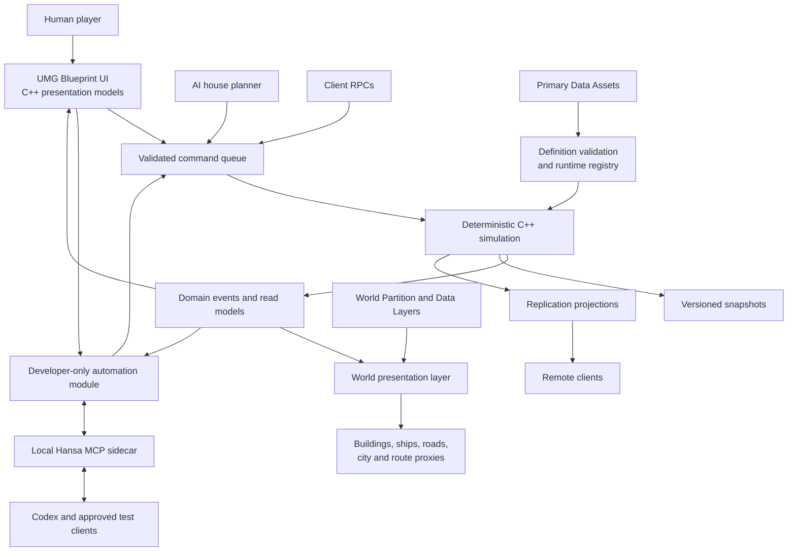
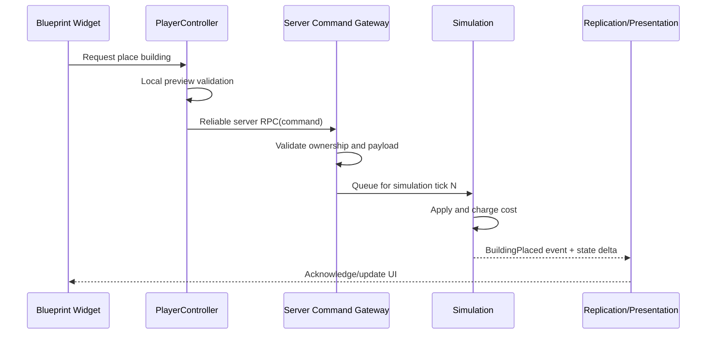

# Hansa — Technical Architecture

## 1. Purpose

This document defines the target architecture for *Hansa*, an Anno-inspired city-builder and trade simulation built primarily in C++ with selected Blueprint use in Unreal Engine 5.8.

It is designed for:

- a buildable northern-European world with 30–50 major cities;
- local production, population needs, and market prices;
- sea, river, and land trade routes;
- AI and 2–8 player multiplayer;
- pausable variable-speed simulation;
- long-running campaigns, save migration, and deterministic testing;
- first-class machine inspection and automation that evolve with gameplay and UI;
- a schema-driven Unreal authoring editor with reviewed AI-assisted data, 3D, animation, dialogue, and audio pipelines;
- a workflow in which designers can add content without rewriting simulation code.

The architecture favors a **modular monolith**: strict internal boundaries and data-driven content without premature microservices, excessive plugins, or an Actor for every simulated object.

## 2. Architectural principles

1. **C++ owns truth.** Economy, placement validation, inventories, routes, AI decisions, research, politics, victory, networking, and persistence are implemented in C++.
2. **Blueprint owns presentation and authored variation.** Blueprint is used for widgets, visual subclasses, animation, audio/VFX hooks, and designer-authored assets—not authoritative economic rules.
3. **The server is authoritative from the first playable build.** Single-player uses the same authority path as multiplayer.
4. **Simulation time is not frame time.** Economic results advance on explicit fixed simulation ticks.
5. **The simulation survives without a rendered world.** Markets and routes continue when a city is streamed out or running on a dedicated server.
6. **Definitions and state are separate.** Immutable authored definitions describe goods and buildings; compact runtime records describe the current campaign.
7. **Commands are the only write boundary.** Human input, AI, scripts, and network clients request changes through the same validated command pipeline.
8. **UI reads projections, not mutable domain state.** Widgets receive purpose-built read models and never search the world for economic truth.
9. **Content is validated before play.** Invalid recipes, missing IDs, circular requirements, and broken soft references fail in editor validation and CI.
10. **Optimize measured bottlenecks.** Begin with a deterministic single-threaded simulation, profile it, then parallelize only where results can be merged deterministically.
11. **Testability ships with the feature.** Gameplay and GUI work is incomplete until its deterministic fixture, semantic inspection, read-only query, controlled command path, assertions, and visual evidence are implemented at the same architectural level as the player-facing functionality.
12. **Authoring ships with the feature.** A gameplay definition or asset capability is incomplete until its editor schema, validation, migration, impact analysis, tests, and applicable generation/import workflow evolve with it.

## 3. High-level architecture



The arrows are intentional:

- Content definitions flow into the simulation through a compiled registry.
- Commands flow inward; events, snapshots, and read models flow outward.
- Actors do not become the database for the campaign.
- UI and AI can observe state but can mutate it only through commands.
- Automation observes the same projections and submits through the same command boundary as players and AI; it does not create a second gameplay API.

## 4. Module strategy

### 4.1 Initial modules

Use five Unreal modules plus two external development tools during the vertical slice:

| Module | Type | Responsibility | May depend on |
| --- | --- | --- | --- |
| `HansaSimulation` | Runtime | Deterministic state, definitions registry, commands, systems, AI-facing queries, serialization primitives | `Core` only where practical |
| `Hansa` | Runtime | Gameplay Framework, Actors, subsystems, networking, input, UI presentation models, asset definitions, simulation composition | `HansaSimulation`, Engine runtime modules |
| `HansaEditor` | Editor | Schema-driven Authoring Studio, definition/graph editing, validation, migrations, impact analysis, staged import/promotion, generation-job UI, and debug inspectors | `Hansa`, `HansaSimulation`, editor-only modules |
| `HansaAutomation` | `DeveloperTool` | Semantic UI registry, fixture control, screenshot capture, gameplay-query adapters, waits/assertions, and the local automation endpoint | `Hansa`, `HansaSimulation`, selected developer-only Engine modules |
| `HansaTests` | `DeveloperTool`/test target | Domain, integration, UI, multiplayer, and end-to-end tests plus deterministic fixtures | `HansaSimulation`, selected `Hansa` code, `HansaAutomation` |
| `Tools/HansaMcp` | External local tool | MCP server and schema adapter for Codex and other approved test clients; never linked into the game | Versioned automation protocol only |
| `Tools/HansaGenerationWorker` | External local tool | OpenAI, TRELLIS, Tripo, ElevenLabs, long-running jobs, credentials, downloads, manifests, and isolated conversion/staging | Versioned editor-generation protocol only |

Keep the existing `Hansa` module as the game integration module. Add `HansaSimulation` first; it creates the most valuable enforced boundary. Add `HansaEditor` as soon as Data Assets exist. Add the smallest usable `HansaAutomation` surface in Phase 0 and grow it in the same change set as each feature. Automation and test code must not ship in the runtime modules or Shipping builds.

### 4.2 Later extraction points

Only extract these when size or build times justify it:

- `HansaAI`: strategic merchant-house planners and scenario AI;
- `HansaUI`: presentation models and reusable UI foundations;
- `HansaOnline`: platform sessions, lobbies, invites, and platform services;
- `HansaDeveloper`: cheats, debug overlays, replay inspection, and profilers.

Do not create a generic `HansaCore` dumping ground. Stable IDs, money, quantities, and other domain primitives belong in `HansaSimulation` unless they genuinely have no domain meaning.

### 4.3 Dependency rule

```text
HansaEditor ───────► Hansa ───────► HansaSimulation
                         ▲                  ▲
HansaAutomation ─────────┴──────────────────┤
       ▲                                    │
HansaTests ─────────────────────────────────┘

Codex/MCP client ◄──► Tools/HansaMcp ◄──► HansaAutomation
```

`HansaSimulation` must never depend on `Hansa`, UMG, Slate, rendering, navigation, online services, or editor modules. Cyclic module dependencies are forbidden.

### 4.4 Automation is a separate Unreal module

`HansaAutomation` is a separate project C++ module with its own `HansaAutomation.Build.cs`, public API boundary, private implementation, log category, and startup/shutdown lifecycle. Declare it as host type `DeveloperTool`, which loads only for targets where Unreal Build Tool enables developer tools. Explicitly exclude Shipping in the module/target configuration as defense in depth.

The dependency direction is one-way: `HansaAutomation` may depend on the runtime modules, but `Hansa` and `HansaSimulation` must never depend on `HansaAutomation`. Runtime code exposes small, transport-neutral inspection seams—stable semantic metadata, public read-only query interfaces, presentation events, and the normal command gateway—which remain useful for accessibility and debugging. The automation module discovers and consumes those seams only when loaded.

Use a project module initially. Convert it to a project plugin only if independent enable/disable in the Unreal Plugins UI, reuse across games, or separate distribution becomes valuable; either packaging form preserves the same module boundary. The external MCP sidecar remains under `Tools/HansaMcp` and is not an Unreal module.

## 5. Recommended source layout

```text
Source/
├── HansaSimulation/
│   ├── HansaSimulation.Build.cs
│   ├── Public/
│   │   ├── Commands/
│   │   ├── Definitions/
│   │   ├── Events/
│   │   ├── Math/
│   │   ├── Model/
│   │   ├── Queries/
│   │   ├── Save/
│   │   └── Systems/
│   └── Private/
├── Hansa/
│   ├── Hansa.Build.cs
│   ├── Public/
│   │   ├── Assets/
│   │   ├── Framework/
│   │   ├── Input/
│   │   ├── Network/
│   │   ├── Presentation/
│   │   ├── Subsystems/
│   │   ├── UI/
│   │   └── World/
│   └── Private/
├── HansaEditor/
│   ├── AssetActions/
│   ├── Debug/
│   ├── Generation/
│   ├── GraphEditors/
│   ├── Import/
│   ├── Migrations/
│   ├── Schema/
│   ├── Studio/
│   ├── Tools/
│   └── Validators/
├── HansaAutomation/
│   ├── Public/
│   │   ├── Protocol/
│   │   └── SemanticUI/
│   └── Private/
│       ├── Endpoint/
│       ├── Fixtures/
│       ├── GameplayQueries/
│       ├── Screenshots/
│       └── Waits/
└── HansaTests/
    ├── Simulation/
    ├── Integration/
    ├── Multiplayer/
    ├── UI/
    ├── EndToEnd/
    └── Fixtures/

Tools/
├── HansaMcp/
│   ├── schemas/
│   ├── src/
│   └── tests/
└── HansaGenerationWorker/
    ├── providers/
    ├── schemas/
    ├── src/
    └── tests/
```

Use Unreal's `Public` folder only for types required by another module. Most headers should remain in `Private` or the narrowest possible public feature folder.

## 6. Gameplay Framework ownership

Unreal's Gameplay Framework already provides server-only `GameMode`, replicated `GameState` and `PlayerState`, player command ownership through `PlayerController`, and lifetime-scoped subsystems. Use those roles instead of inventing parallel global managers.

| Class | Lifetime/network role | Hansa responsibility |
| --- | --- | --- |
| `UHansaGameInstance` | Process/session; not replicated | Minimal composition root and persistent front-end state |
| `UHansaSessionSubsystem` | `UGameInstanceSubsystem` | Host/join/leave, platform session adapter, lobby metadata |
| `UHansaSaveSubsystem` | `UGameInstanceSubsystem` | Save discovery, async read/write, migration orchestration |
| `AHansaGameMode` | Server only, per gameplay world | Join rules, scenario setup, pause/speed policy, command authorization, victory conclusion |
| `AHansaGameState` | Server and replicated clients | Campaign ID, authoritative clock projection, scenario phase, public victory progress |
| `AHansaPlayerState` | Server and all clients | House identity, public score/reputation, team, connection and defeat status; used for humans and major AI houses |
| `AHansaPlayerController` | Server plus owning client | Input intent, server RPC command gateway, owner-only responses and camera mode |
| `AHansaCameraPawn` | Possessed local world representation | Camera movement, zoom, rotation, selection trace origin; no economic state |
| `UHansaSimulationSubsystem` | `UWorldSubsystem`/tickable, authority | Owns and advances the C++ simulation on server or standalone |
| `UHansaSelectionSubsystem` | `ULocalPlayerSubsystem` | Local selection, hover, placement preview, input mode |
| `UHansaPresentationSubsystem` | Client world | Converts simulation/read-model updates into world and UI presentation events |

Subsystems have managed lifetimes and Blueprint exposure, which makes them appropriate for scoped services. They should still remain cohesive; do not turn one subsystem into a universal service locator.

## 7. Simulation core

### 7.1 Runtime model

The authoritative campaign is an `FHansaSimulationState` composed of plain, serializable C++ records:

```text
FHansaSimulationState
├── Calendar and simulation tick
├── Campaign seed and deterministic RNG state
├── Cities[]
│   ├── Population cohorts and needs
│   ├── Local market stocks, demand, prices, and history
│   ├── Buildings and production jobs
│   ├── Warehouses and reservations
│   └── Policies, privileges, and public projects
├── Houses[]
│   ├── Money, credit, reputation, and research
│   ├── Owned buildings, vehicles, offices, and contracts
│   └── AI state or human ownership
├── Vehicles[] and Routes[]
├── Contracts[] and PoliticalState
├── ScheduledEvents[]
└── QueuedCommands[]
```

This model contains no `AActor*`, component pointer, widget, material, animation, or level reference. Runtime records use stable IDs to refer to definitions and other records.

### 7.2 Stable identifiers

Use explicit wrappers rather than passing unrelated integers or names:

- definition IDs: `FHansaGoodId`, `FHansaRecipeId`, `FHansaBuildingTypeId`, `FHansaCityDefinitionId`;
- runtime IDs: `FHansaHouseId`, `FHansaBuildingId`, `FHansaVehicleId`, `FHansaRouteId`, `FHansaContractId`;
- network/save identity: stable integer value plus generation/version where reuse could be unsafe.

Definitions may originate from `FPrimaryAssetId`, but the simulation receives compact validated IDs from the runtime definition registry. Saves store stable definition names/IDs, never UObject pointers or asset paths scattered through state.

### 7.3 Deterministic numeric types

- Money: signed `int64` in the smallest currency unit.
- Quantity: signed `int64` in fixed sub-units, such as milli-units.
- Rates and percentages: explicit fixed-point type with checked multiply/divide.
- Calendar and duration: integer simulation ticks/minutes.
- Location on economic networks: node/edge ID plus fixed-point progress.

Avoid floating-point values for money, inventory, pricing, production completion, and route arrival decisions. Floating point is acceptable in visual interpolation, camera behavior, and rendering.

All iteration that can affect results must use a stable order. Do not let `TMap`/`TSet` iteration order decide which buyer receives scarce grain. Random outcomes use a named deterministic stream whose seed and state are serialized.

### 7.4 Simulation clock

The server accumulates real time and advances zero or more fixed simulation steps according to the selected game speed. A suggested starting granularity is one simulated hour per economic step, with scheduled events for production and route arrivals.

- Pause means no authoritative simulation steps.
- Higher speeds process multiple steps within a bounded frame budget.
- Multiplayer speed changes follow the host/scenario voting policy.
- Visual movement interpolates between authoritative route positions.
- A late client receives the current snapshot and tick; it does not replay the entire campaign.

The tick duration is a balancing constant, not an implicit dependency in each system. Every duration is stored in simulation units.

### 7.5 Ordered system pipeline

Keep the update pipeline explicit and versioned. A starting order is:

1. apply validated commands scheduled for this tick;
2. advance calendar and activate scheduled world events;
3. complete vehicle movement, arrivals, loading, and unloading;
4. process warehouse reservations, spoilage, and storage costs;
5. advance construction and production jobs;
6. allocate workforce and evaluate household needs;
7. create and clear local market demand/supply orders;
8. update smoothed local prices and market history;
9. apply wages, upkeep, tax, credit, contracts, and insolvency;
10. progress research, politics, migration, and victory checks;
11. publish domain events, dirty read models, and a determinism checksum.

The exact economic ordering can change during prototyping, but it must never depend on Actor tick order.

### 7.6 Systems are services over state

Prefer small systems with explicit input state:

- `FHansaProductionSystem`
- `FHansaPopulationSystem`
- `FHansaMarketSystem`
- `FHansaLogisticsSystem`
- `FHansaFinanceSystem`
- `FHansaResearchSystem`
- `FHansaPoliticsSystem`
- `FHansaEventSystem`
- `FHansaVictorySystem`

Systems should not retain hidden mutable campaign state. This makes snapshots, test setup, replay, and future parallelization substantially safer.

## 8. Data-driven content

### 8.1 Authoring assets

Create C++ subclasses of `UPrimaryDataAsset` for designer-authored definitions:

| Asset class | Examples of data |
| --- | --- |
| `UHansaGoodDefinition` | ID, name, unit, base value, elasticity, spoilage, tags, icon |
| `UHansaRecipeDefinition` | Inputs, outputs, cycle time, workforce, fuel, conditions |
| `UHansaBuildingDefinition` | Cost, footprint, road/shore rules, recipes, services, visual soft references |
| `UHansaNeedDefinition` | Population tier, good/service, consumption, satisfaction effect |
| `UHansaVehicleDefinition` | Capacity, speed, draft, crew, upkeep, route capabilities |
| `UHansaCityDefinition` | Historical identity, map node, base population, resources, laws, modifiers |
| `UHansaRegionDefinition` | Terrain, fertility, deposits, water/road graph, build rules |
| `UHansaTechnologyDefinition` | Prerequisites, cost, unlocks, mutually exclusive choices |
| `UHansaEventDefinition` | Conditions, weighted outcomes, effects, presentation hooks |
| `UHansaVictoryDefinition` | Eligibility, progress queries, completion rules |
| `UHansaScenarioDefinition` | Map, start date, houses, rules, goals, enabled content |

The Asset Manager supports explicit discovery and loading of Primary Assets. Use soft references for meshes, sounds, materials, and widget classes so dedicated servers and headless tests do not load presentation content.

Accepted Unreal assets remain the authoring source of truth. The editor derives generic forms, graph descriptors, validation coverage, and JSON Schemas from the reflected C++ definition contracts. JSON is used for reviewed interchange, diff, and AI proposals rather than becoming a second independently maintained data model. The complete editor and generation approach is defined in [EditorArchitecture.md](EditorArchitecture.md).

### 8.2 Definition compilation

At scenario startup—or as an editor cook step later—convert loaded Data Assets into an immutable `FHansaDefinitionRegistry` containing compact simulation-only structs.

The compilation step:

- resolves every stable ID;
- rejects duplicates and missing references;
- computes lookup tables and production ratios;
- detects circular technology and building prerequisites;
- separates server data from presentation references;
- produces a definition hash stored in saves and multiplayer lobby metadata.

The simulation reads only this registry. It does not repeatedly dereference Data Assets during hot loops.

### 8.3 Content validation

Override `IsDataValid` on custom definition assets and add `UEditorValidatorBase` validators for cross-asset rules. Validation should fail for:

- duplicate or empty stable IDs;
- negative costs/cycle times/capacities;
- recipes with no output;
- missing icons/meshes where production content requires them;
- mutually unreachable technology nodes;
- circular prerequisite chains;
- goods used by recipes but unavailable in the selected scenario;
- building footprints that do not match placement metadata;
- save-breaking ID changes without an explicit redirect.

Run `UnrealEditor-Cmd.exe Hansa.uproject -run=DataValidation` in CI.

### 8.4 Content directory

```text
Content/Hansa/
├── Core/
│   ├── Goods/
│   ├── Recipes/
│   ├── Needs/
│   ├── Technologies/
│   └── Scenarios/
├── World/
│   ├── Europe/
│   ├── Cities/
│   ├── Buildings/
│   ├── Vehicles/
│   └── DataLayers/
├── UI/
│   ├── Widgets/
│   ├── Icons/
│   └── Styles/
├── Audio/
├── VFX/
└── Developer/
```

Keep project content under one root to make migration, audits, and asset-reference rules manageable. Put temporary prototypes in `Developer`, not beside shipping assets.

## 9. Command and event architecture

### 9.1 Commands

Every state-changing request becomes a typed command, for example:

- `FHansaPlaceBuildingCommand`
- `FHansaDemolishBuildingCommand`
- `FHansaCreateRouteCommand`
- `FHansaSetRouteRulesCommand`
- `FHansaBuyMarketOrderCommand`
- `FHansaChangeProductionCommand`
- `FHansaStartResearchCommand`
- `FHansaCastCouncilVoteCommand`
- `FHansaOfferContractCommand`

Each command includes:

- unique command ID;
- issuing house/player;
- requested execution tick;
- typed payload;
- protocol/schema version where serialized.

The server validates identity, ownership, cost, prerequisites, placement, capacity, and current state. Rejections return a stable reason code suitable for localization. Blueprints never bypass this pipeline by changing authoritative properties.

### 9.2 Command flow



Local preview validation improves responsiveness but is never authoritative.

### 9.3 Domain events

Systems emit immutable domain events after successful changes:

- building completed;
- good shortage began/ended;
- vehicle arrived/lost;
- price threshold crossed;
- population tier unlocked;
- contract completed/failed;
- technology researched;
- player became insolvent;
- victory condition progressed/completed.

Events drive alerts, audio, VFX, tutorials, achievements, AI observations, and dirty read models. Do not use events as an unbounded permanent history by default; persist only events needed by gameplay, audit, or the timeline.

## 10. World and presentation architecture

### 10.1 One logical gameplay world

Use one strategically compressed European gameplay world rather than attempting literal 1:1 geography. Coastal regions, islands, river valleys, and city sites are spatially separated but remain within one shared `UWorld`, allowing multiple players to view and build in different regions without cross-server travel.

Use World Partition, Data Layers, level instances where helpful, and HLODs for scalable authoring and streaming. Crucially, World Partition streams presentation Actors—not economic truth. A city continues consuming food and changing prices when no client has its cell loaded.

### 10.2 Simulation records versus Actors

| Simulation truth | World presentation |
| --- | --- |
| `FHansaCityState` | `AHansaCityAnchor` and streamed district proxies |
| `FHansaBuildingState` | `AHansaBuildingActor` or instanced visual |
| `FHansaVehicleState` | `AHansaTradeVehicleActor` when relevant/visible |
| `FHansaRouteState` | Spline/map overlay and optional moving proxy |
| Population cohorts | Ambient crowds/agents generated from aggregate data |
| Warehouse inventory | Visual cargo stacks sampled from inventory bands |

Actors keep their simulation ID and request current presentation data. They do not own balances, production timers, or inventories.

### 10.3 Building placement

1. The local placement tool reads the immutable building definition.
2. A translucent Blueprint/C++ preview checks grid, slope, shoreline, road, and obvious collision rules.
3. On confirmation, the client sends a placement command with region, footprint cells, rotation, and building type ID.
4. The server validates against the authoritative build grid, ownership/privileges, cost, and current reservations.
5. The simulation creates the building record and emits an event.
6. The presentation layer spawns or updates the corresponding visual Actor/instance.

Keep a compact authoritative occupancy grid in simulation state. Physics overlap alone is not sufficient for reproducible placement validation.

### 10.4 Internal city logistics

Economic routing uses authored/generated road and harbor graphs, not decorative agent navigation:

- warehouses and production buildings connect to logistics nodes;
- route cost includes distance, surface, congestion, and transfer capacity;
- deliveries are aggregated jobs with known quantities and completion times;
- visible carts/porters are presentation proxies for those jobs;
- local decorative citizens can use Mass or lightweight agents later, but never become authoritative households.

### 10.5 Long-distance vehicles

Ships, barges, and caravans remain authoritative simulation records. Visible `AHansaTradeVehicleActor` instances interpolate along route splines or graph edges. Only vehicles relevant to a client need full visual Actors and frequent position updates.

## 11. Multiplayer and replication

### 11.1 Authority model

- Dedicated server is the target architecture; listen server is supported for development and casual games.
- Single-player starts an authoritative local world and uses the same command pipeline.
- Clients never calculate accepted prices, inventory transfers, placement results, research completion, or victory.
- AI houses run on the server and issue the same commands as humans.

### 11.2 Replicate projections, not the entire simulation

The full `FHansaSimulationState` stays server-side. Replication publishes scoped projections:

| Projection | Audience | Example data |
| --- | --- | --- |
| Global campaign | Everyone | Clock, season, public events, victory state |
| House public state | Everyone | Name, emblem, public reputation, visible score |
| House private state | Owner/team | Money, credit, research, private contracts, reports |
| Region/city state | Interested/relevant clients | Visible buildings, construction, public stock/market summaries |
| Vehicle state | Spatially relevant/owner | Route leg, position, cargo visibility permitted by rules |
| Market report | Requesting authorized player | Price/stock with report timestamp and information delay |

Use replicated Actor/components and delta-serialized arrays for coarse projections. Large histories, reports, and join snapshots should be chunked and transferred deliberately rather than placed on one enormous replicated `GameState` property.

### 11.3 RPC policy

- Reliable server RPCs: discrete player commands and confirmations that cannot be dropped.
- Unreliable RPCs/replication: transient cursors, hover intent, nonessential presentation.
- Owner-only responses: private economy and error details.
- Rate-limit and size-check all client requests.
- Never accept client-provided price, cost, elapsed time, ownership, or resolved output.

### 11.4 Relevancy and replication technology

Start the vertical slice on Unreal's generic replication system with careful relevancy, dormancy, and update frequency. Keep an abstraction between simulation projections and Unreal replication so Iris can be evaluated later without rewriting the economy.

Adopt Replication Graph only if profiling shows that many visible building/vehicle Actors make per-connection relevancy expensive. It is designed for large Actor counts, but it does not replace domain-level interest management or compact market projections.

### 11.5 Join in progress and resynchronization

1. Authenticate and validate scenario/definition hash.
2. Spawn `PlayerController`/`PlayerState` and establish house permissions.
3. Send a versioned compressed projection snapshot in bounded chunks.
4. Buffer state deltas generated after the snapshot tick.
5. Apply snapshot, then buffered deltas, then mark the client ready.
6. Periodically compare coarse checksums and request resynchronization if necessary.

The authoritative simulation does not pause while a client joins.

## 12. AI architecture

Major AI houses use a hierarchical economic planner, not one Behavior Tree ticking for the entire company.

```text
House strategy (months/seasons)
└── Goals: expand, stabilize food, gain influence, dominate cloth
    └── Portfolio planner (days/weeks)
        ├── Production opportunities
        ├── Market opportunities
        ├── Route and fleet needs
        ├── Finance/risk limits
        └── Political actions
            └── Commands through the normal command gateway
```

AI reads an `IHansaSimulationQuery` interface filtered by its legitimate knowledge. Difficulty changes planning horizon, evaluation quality, reaction delay, and risk tolerance—not free resources or hidden omniscience.

Recommended AI components:

- `FHansaHouseBrain`: goals, personality, memory, commitments;
- `FHansaOpportunityScanner`: shortages, margins, contracts, production gaps;
- `FHansaPlanEvaluator`: cost, time, risk, dependency, strategic value;
- `FHansaRoutePlanner`: path/capacity/fleet selection over the economic graph;
- `FHansaExecutionMonitor`: detects failed assumptions and replans;
- `FHansaDiplomacyPlanner`: offers, votes, sanctions, coalitions.

Behavior Trees, State Trees, navigation, or Mass may still control local decorative agents and tactical ship presentation. They are not the strategic economy brain.

## 13. UI architecture

### 13.1 Presentation models

Build C++ `UObject` presentation/view-model classes that transform read-only queries into UI-friendly data:

- `UHansaCityViewModel`
- `UHansaMarketViewModel`
- `UHansaProductionViewModel`
- `UHansaRouteViewModel`
- `UHansaHouseViewModel`
- `UHansaResearchViewModel`
- `UHansaSelectionViewModel`

Blueprint UMG widgets bind to exposed fields/events and send user intent back through controllers/presenters. View models cache formatted/aggregated values and update only when relevant domain data changes.

Do not use Blueprint tick or raw UMG function bindings to repeatedly scan all cities, buildings, or goods. Do not expose mutable simulation containers to widgets.

Unreal's UMG Viewmodel/MVVM feature is documented as Beta in 5.8, so the core architecture should not require it for shipping. A small project-owned presentation interface keeps migration to or from that plugin possible.

### 13.2 Input

Use Enhanced Input and separate mapping contexts for:

- world camera and selection;
- building placement;
- route editing;
- modal UI;
- debug/developer tools.

Input Actions express intent such as Select, ConfirmPlacement, RotateBuilding, OpenMarket, and ToggleOverlay. They do not directly edit simulation state.

### 13.3 Blueprint responsibilities

Good Blueprint use:

- UMG widget composition, layout, animation, and accessibility;
- Blueprint children of C++ building/vehicle presentation Actors;
- materials, Niagara, sound, camera shakes, and visual state transitions;
- event presentation and scenario-specific visual sequences;
- Data Asset instances and balanced authored content;
- lightweight level scripting that sends commands through public C++ APIs.

Keep in C++:

- simulation math and state transitions;
- authoritative placement and economic validation;
- save serialization and migrations;
- multiplayer protocol and replication projections;
- AI planning and route evaluation;
- stable IDs, definitions, and asset validators;
- performance-sensitive queries and data aggregation.

Blueprint classes must not contain a second implementation of prices, inventory, production, or victory rules.

## 14. First-class inspection and automation architecture

Automation is a product capability for development, testing, balancing, accessibility verification, and AI-assisted quality assurance. It must be designed alongside the game rather than retrofitted after feature completion. The shipping game remains independent of it.

### 14.1 Architecture and process boundary

```text
Codex or approved test client
        │ MCP over STDIO by default
        ▼
Tools/HansaMcp local sidecar
        │ versioned messages over a named pipe
        │ or opt-in localhost WebSocket
        ▼
HansaAutomation DeveloperTool module
        ├── UHansaAutomationSubsystem
        ├── semantic UI registry
        ├── deterministic fixture controller
        ├── gameplay query facade
        ├── controlled action facade
        ├── wait/assertion service
        └── native screenshot service
               │
               ├── reads normal projections and query interfaces
               └── writes through the normal validated command pipeline
```

The MCP sidecar is deliberately out of process. An Unreal crash therefore cannot take the test orchestrator and its partial evidence down with it. MCP is the tool/orchestration contract; semantic UI inspection, screenshots, fixtures, queries, commands, and waits are complementary capabilities exposed through that contract.

Use STDIO between Codex and the sidecar for the default local workflow. Use a named pipe between the sidecar and game on Windows. A loopback-only WebSocket may be added for cross-platform or multiple-client workflows, but it must require explicit enablement and authentication.

### 14.2 Feature-parity contract

Gameplay, UI, and automation are one delivery stream. A feature is not architecturally complete until the applicable row below is implemented in the same change set:

| Player-facing capability | Required automation counterpart |
| --- | --- |
| Authoritative state or calculation | Typed, read-only gameplay query returning stable IDs, raw values, units, and causal factors |
| Player action | Typed automation action routed through the same validation and command handler as human input, AI, and multiplayer |
| Screen or reusable widget | Stable semantic node IDs, roles, state, relationships, and available actions |
| Time-dependent behavior | Deterministic simulation stepping plus condition-based waits; no correctness test depends on arbitrary sleep duration |
| Scenario or edge case | Versioned deterministic fixture with seed, content hash, initial tick, and expected checksum |
| Visible result | Native-resolution screenshot of the viewport or named region, correlated with semantic and gameplay state |
| Rule or invariant | Structured assertion and automated regression test |
| Multiplayer-only behavior | Server-authoritative query/action coverage and a multi-process fixture where applicable |

For a headless-only domain feature, visual evidence is required once the feature gains player-visible presentation. For a purely decorative component, gameplay queries may not apply, but semantic state and screenshot evidence still do.

Every feature pull request or implementation task must record which counterparts apply, where they are tested, and why any row is not applicable. A placeholder automation hook does not satisfy the contract.

### 14.3 Semantic UI inspection

All interactive and information-bearing UMG/Slate components must register a stable semantic identity independent of widget instance names, screen coordinates, localized text, and visual hierarchy. Prefer namespaced IDs such as:

```text
Market.GoodsTable
Market.GoodsTable.Row[Good=Grain]
Market.GoodsTable.Row[Good=Grain].LocalPrice
Market.GoodsTable.Row[Good=Grain].CreateRoute
TradeRoute.Editor.Confirm
```

The semantic tree exposes only test-relevant, authorized information:

```json
{
  "id": "Market.GoodsTable.Row[Good=Grain].CreateRoute",
  "role": "button",
  "labelKey": "UI.Market.CreateRoute",
  "visible": true,
  "enabled": true,
  "focused": false,
  "selected": false,
  "boundsPx": [1480, 812, 208, 44],
  "screen": "Market",
  "actions": ["activate"],
  "state": {}
}
```

Semantic actions such as `activate`, `select`, `set_value`, `scroll`, and `focus` call the same presenter/controller intent used by normal input. Coordinate clicks remain available only for diagnostic comparison and must not be the primary automation mechanism.

The semantic registry must support:

- discovery by stable ID, role, definition ID, and parent/child relationship;
- visibility, enabled, focus, selection, loading, warning, and error states;
- localized label keys and optional rendered text for localization tests;
- pixel bounds and clipping information at the captured resolution;
- table/list virtualization without requiring all off-screen rows to exist as widgets;
- accessibility relationships, including label, description, and focus order;
- a monotonically increasing UI revision and the simulation tick/frame that produced it.

### 14.4 Screenshot evidence

The screenshot service captures the full game viewport or a semantic node/region by stable ID. Each result records:

- fixture ID and version;
- campaign seed and simulation tick;
- rendered frame and UI revision;
- viewport pixel dimensions and UI scale;
- active map, screen, input device mode, language, and color-vision mode;
- screenshot hash and an optional linked semantic-state snapshot.

Screenshots must be captured and stored at the native requested pixel dimensions. They must never be stretched, downscaled, upscaled, or otherwise resampled to satisfy a test. Separate captures are required for each supported resolution, aspect ratio, UI scale, and raster asset density defined by `Docs/UIDesignBrief.md` and `Docs/UIAssetWorkflow.md`.

Screenshots are evidence for hierarchy, clipping, overlap, typography, state styling, focus visibility, color use, and overall polish. Structured assertions remain authoritative for quantities, prices, ownership, route state, and other deterministic facts.

### 14.5 Deterministic fixtures

A fixture is a versioned, reviewable test scenario, not an editor save assembled manually during the test. It contains or references:

- fixture schema version and stable fixture ID;
- definition/content hash and supported game/save version;
- deterministic seed and named RNG stream states;
- initial simulation tick and authoritative state snapshot or declarative setup;
- participating houses, permissions, city and market conditions;
- camera, map, active screen, viewport, locale, and input mode when visual testing applies;
- expected preconditions, checkpoints, and final checksum;
- fixture owner and migration history.

Fixtures must support fast headless domain tests and launched-game UI tests from the same underlying authoritative state. Keep small reusable fixture builders for focused tests and golden fixture files for regression, save migration, multiplayer, and visual scenarios.

Initial end-to-end fixture: `lubeck_grain_shortage_v1`. It loads a known shortage, opens the Lübeck market, proves the supply/demand and price causes, creates an authorized import route, advances a fixed number of ticks, verifies delivery and the resulting price movement, and captures correlated UI evidence.

### 14.6 Gameplay queries and controlled actions

Automation query adapters must reuse the narrow read-only interfaces already consumed by AI, UI presentation models, debugging, and replication projections. They may add diagnostic detail, such as causal factors or reservation owners, but must not expose mutable state references.

Required query families grow with their corresponding systems:

- session, scenario, clock, seed, tick, checksums, pause, and speed;
- cities, population cohorts, needs, migration, workforce, and service coverage;
- goods, production jobs, inputs, outputs, blockers, and efficiency;
- markets, stock, reservations, supply, demand, orders, prices, and price causes;
- houses, finance, credit, reputation, knowledge, and research;
- vehicles, cargo, routes, path legs, ETAs, loading, and unloading;
- AI goals, known facts, evaluated plans, and chosen command;
- politics, contracts, events, victory progress, and defeat state;
- replication visibility and public/private projection age for multiplayer tests.

Mutating automation actions must use explicit typed request schemas and submit normal domain commands. Do not add direct setters for money, inventory, research, ownership, or market price. Exceptional fixture setup may construct authoritative initial state before play begins; after the fixture starts, normal game rules apply unless the test explicitly enters a named fault-injection mode.

### 14.7 MCP tool surface and protocol

Keep MCP tools small, typed, composable, and bounded. A starting surface is:

| Category | Tools |
| --- | --- |
| Session | `session_get`, `session_start`, `session_stop`, `capabilities_get` |
| Fixtures | `fixture_list`, `fixture_load`, `fixture_reset` |
| Simulation | `simulation_step`, `simulation_run_until`, `gameplay_query` |
| Semantic UI | `ui_tree`, `ui_find`, `ui_state`, `ui_activate`, `ui_set_value`, `ui_scroll` |
| Evidence | `capture_screenshot`, `logs_get`, `evidence_bundle_create` |
| Synchronization | `wait_for`, `assert_state`, `test_run` |

Read-only tools are the default. Mutating tools must be clearly identified and independently allowlisted. Prefer purpose-built resources and tools over one generic operation with an unbounded query language.

All protocol messages use a versioned envelope:

```json
{
  "schemaVersion": 1,
  "requestId": "01J...",
  "sessionId": "editor-18432",
  "fixture": "lubeck_grain_shortage_v1",
  "simulationTick": 18240,
  "frame": 12881,
  "uiRevision": 731,
  "payload": {}
}
```

Responses have bounded payload sizes, explicit units, stable IDs, machine-readable error codes, timeouts, and pagination/cursors for large collections. The sidecar performs schema adaptation but does not invent gameplay truth.

### 14.8 Synchronization and evidence bundles

Tests synchronize on observable conditions such as `MarketScreen.ready`, `Route.status == Active`, or `City[Lubeck].Stock[Grain] >= 1000`. `wait_for` evaluates conditions against UI revisions, domain events, or simulation ticks and returns the state that satisfied or timed out the wait.

An end-to-end failure should produce one evidence bundle containing:

- test and fixture identity;
- accepted commands and structured results;
- relevant gameplay-query snapshots;
- semantic UI snapshots;
- native-resolution screenshots;
- bounded log excerpts and assertion failures;
- tick, frame, UI revision, build, map, content hash, and determinism checksum.

This makes a failure reproducible without requiring the original tester's machine state.

### 14.9 Security, release exclusion, and easy disablement

The automation surface is absent from a released game, not merely hidden:

- `HansaAutomation` is a separate `DeveloperTool` module and is enabled only for approved Editor, Development, and Test targets; Shipping targets must not compile, link, or load it.
- Wrap any minimal runtime integration seam in `WITH_HANSA_AUTOMATION`, defaulting to `0`; Shipping compilation must remove the calls and related strings/symbols.
- `Tools/HansaMcp`, schemas, test credentials, fixtures intended only for QA, and automation configuration are never cooked, staged, or included in release depots.
- Development and Test builds keep the endpoint disabled by default. Enable it explicitly with a dedicated launch option such as `-HansaAutomation` plus a short-lived session token or an editor-only control.
- Disabling the endpoint must require no content edits and no Blueprint rewiring; it is controlled at target/build composition and process startup.
- When disabled, the game opens no automation socket/pipe, registers no automation commands, and incurs no per-frame automation work.
- The endpoint binds only to a per-session named pipe or loopback interface, fails closed on authentication/version mismatch, and accepts one explicitly authorized controller unless a test requires otherwise.
- Read-only and mutating capabilities are negotiated separately and logged. Dangerous capabilities require a test profile and cannot be enabled by data received from an untrusted client.
- Never expose arbitrary console execution, arbitrary UObject/Blueprint reflection, raw memory access, unrestricted filesystem access, raw SQL, arbitrary C++ invocation, or asset/class loading by client-supplied path.
- Add a packaged-Shipping verification test that checks the module and sidecar are absent, the enable flag is rejected or ignored, no endpoint is opened, and representative automation symbols/configuration are not staged.

The normal game must function identically with automation disabled. Release exclusion is a continuous-integration gate, not a manual packaging checklist.

## 15. Save, load, and replay

### 15.1 Save envelope

Use a `USaveGame`-compatible envelope or custom archive with:

- save format version;
- game/build version;
- scenario ID and definition hash;
- UTC timestamp and display metadata;
- campaign seed and simulation tick;
- compressed `FHansaSimulationState` payload;
- deterministic RNG states;
- queued commands/events that affect future results;
- optional thumbnail and player-facing summary.

Serialize stable values and IDs, not Actors or raw UObject graphs. Rebuild presentation Actors from loaded simulation state.

### 15.2 Migrations

Every breaking state change adds a migration from version N to N+1. Asset renames require explicit definition ID redirects. Keep golden save fixtures for supported versions and load them in automated tests.

### 15.3 Multiplayer saves

- Only the authoritative server writes the campaign save.
- Autosaves use an immutable snapshot captured at a tick boundary, then write asynchronously.
- Client profiles may store local settings and UI preferences separately.
- Loading validates all peers against the scenario/content hash before play begins.

### 15.4 Replay and diagnostics

During development, optionally record initial seed/snapshot plus accepted commands and periodic checksums. This supports deterministic bug reproduction without making command replay the only shipping save format.

## 16. Testing strategy

### 16.1 Test pyramid

| Layer | Tool | Examples |
| --- | --- | --- |
| Pure/domain | UE Low-Level Tests or fast C++ automation tests | Price response, recipe conservation, fixed-point math, route ETA, debt interest |
| Simulation integration | Automation Specs/tests | 10-year economy, famine recovery, AI solvency, victory progress |
| Unreal integration | Automation Framework | Asset registry compile, Actor projection, placement, save/load |
| Semantic UI | Automation Framework through `HansaAutomation` | Widget discovery, focus, state, intent routing, accessibility relationships |
| Visual/evidence | Launched-game automation | Native-resolution screen states, clipping, layout, correlated semantic snapshots |
| MCP end-to-end | `Tools/HansaMcp` plus a launched game | Fixture load, query/action workflow, waits, assertions, evidence bundle |
| Multiplayer functional | Multi-process automation | Command rejection, late join, owner-only data, resync |
| Content validation | Data Validation commandlet | IDs, references, recipe/tech graph, soft assets |
| Performance/soak | Dedicated benchmark scenarios | 50 cities, 70 goods, 8 houses, maximum game speed |

### 16.2 Required invariants

- Goods cannot appear or disappear except through declared production, consumption, spoilage, loss, or scenario effects.
- Money transfers balance, except declared sources/sinks such as minting/taxes/scenario grants.
- Inventory and reserved quantity never become negative.
- The same seed, definitions, initial state, and command stream produce the same checksum.
- Clients cannot spend or transfer another house's assets.
- A save/load round trip preserves the authoritative checksum.
- Price movement remains bounded and converges under stable supply/demand.
- A streamed-out city produces the same economic result as a visible city.
- The same fixture, command sequence, definition hash, and tick count produce the same query results and checksum with or without rendering.
- A semantic UI value representing authoritative state agrees with the correlated gameplay query at the same simulation tick/UI revision.
- Enabling automation does not bypass command validation, authorization, information visibility, or multiplayer authority.

### 16.3 Continuous integration gates

1. Compile editor and game targets.
2. Run format/static analysis selected by the team.
3. Run fast simulation tests.
4. Run Data Validation.
5. Run headless integration tests and deterministic/save fixtures.
6. Run semantic UI and MCP contract tests for changed feature areas.
7. On main/nightly: launched-game visual workflows, multiplayer tests, determinism soak, and performance scenarios.
8. Cook/package Shipping and prove that `HansaAutomation`, the MCP sidecar, automation-only fixtures/configuration, and endpoints are absent.

## 17. Performance budgets and strategy

Establish repeatable benchmark scenarios before optimizing. Initial full-campaign target:

- 30–50 major cities;
- 50–70 goods;
- thousands of building records;
- hundreds of strategic vehicles/routes;
- 2–8 major houses plus background trade;
- population represented as cohorts, not individual simulated citizens.

### Simulation

- Prefer contiguous arrays indexed by compact IDs for hot data.
- Cache definition lookups and computed recipe/need tables.
- Update systems at the lowest frequency their design requires.
- Dirty only changed read models and replication projections.
- Use scheduled work queues rather than scanning every record every frame.
- Begin single-threaded; later parallelize independent city evaluation with deterministic ordered merge.

### Presentation

- Use instanced meshes/HISM for roads, fields, repeated props, and suitable buildings.
- Pool common transient presentation Actors.
- Aggregate ambient citizens and carts; use significance-based density.
- Use World Partition, Data Layers, and HLODs for distant or inactive regions.
- Avoid one replicated Actor per citizen, inventory stack, market order, or production cycle.

### Networking

- Replicate changed projections at design-appropriate rates, not every server frame.
- Quantize visual positions and rates where acceptable.
- Apply relevancy by region, ownership, visibility, and information access.
- Keep price history and large reports request-based or chunked.
- Profile bandwidth and server replication CPU before choosing Replication Graph or Iris-specific features.

## 18. Logging, metrics, and debugging

Define log categories by domain:

- `LogHansaSimulation`
- `LogHansaMarket`
- `LogHansaLogistics`
- `LogHansaNetwork`
- `LogHansaAI`
- `LogHansaSave`
- `LogHansaContent`

Add developer-only overlays for:

- current tick, speed, step duration, and checksum;
- city stock/reserve days, demand, supply, and price factors;
- production bottlenecks and warehouse reservations;
- route graph, ETA, congestion, and vehicle state;
- AI goals, known facts, evaluated options, and chosen command;
- replication projection size and update age.

Every market-price change shown to the player should retain causal factors suitable for UI explanation and debugging.

## 19. Security and validation

Treat every multiplayer client as untrusted:

- validate command type, size, IDs, ownership, visibility, range, resources, cooldown, and prerequisites;
- use server-generated IDs for new runtime entities;
- reject duplicate command IDs and stale commands where relevant;
- cap route stops, market order quantities, text lengths, and request frequency;
- sanitize player text and never derive asset paths or class names from it;
- never load client-supplied save state into an authoritative public session;
- record security-relevant rejections with player/house and reason code.

## 20. Build targets and configuration

Target build layout:

```text
Hansa.Target.cs          Game client/listen server
HansaEditor.Target.cs    Editor and authoring tools
HansaServer.Target.cs    Dedicated authoritative server
HansaTests target/module Automated domain, integration, UI, and end-to-end tests
HansaAutomation module   Editor/Development/Test only; excluded from Shipping
```

Use configuration for environment-sensitive values such as service endpoints and log verbosity. Do not store credentials in `.ini`, Data Assets, source, or Blueprint defaults.

Recommended built-in engine capabilities to evaluate/use:

- Enhanced Input;
- Gameplay Tags for categories and rule labels, not unique entity identity;
- Asset Manager and Primary Data Assets;
- World Partition, Data Layers, and HLOD;
- Data Validation;
- Unreal Insights and CSV profiling;
- generic replication first, Replication Graph/Iris after measured evaluation;
- Online Services/Online Subsystem behind a project-owned session adapter selected when storefront requirements are known.

Avoid making a Beta or Experimental plugin a foundational dependency unless the team explicitly accepts the shipping and migration risk.

## 21. Implementation sequence

The bounded product milestone across game, editor, and hybrid automation is defined in [MVP.md](MVP.md). The phases below describe the broader architecture sequence; MVP work must obey the narrower inclusions, exclusions, parity matrix, and acceptance gates in that document.

### Phase 0 — Architecture skeleton

- Remove the placeholder `MyClass`.
- Add `HansaSimulation`, `HansaEditor`, and test module/target structure.
- Establish the `HansaEditor` schema registry, common definition base/versioning contract, generic details fallback, metadata-coverage test, and Shipping exclusion gate described in `Docs/EditorArchitecture.md`.
- Use the bounded first milestone and acceptance criteria in `Docs/MVP.md` and the subordinate editor detail in `Docs/EditorMVP.md`; do not pull post-MVP providers, skeletal animation, full narrative tooling, or full-campaign gameplay into the foundation.
- Add the separate `HansaAutomation` `DeveloperTool` module, transport-neutral protocol envelope, opt-in startup flag, and disabled-state test.
- Scaffold the out-of-process `Tools/HansaMcp` sidecar with capability/schema handshake and one read-only health/session tool.
- Implement stable IDs, fixed-point quantity/money, deterministic RNG wrapper, simulation clock, command result, and definition registry interfaces.
- Add a minimal `AHansaGameMode`, `AHansaGameState`, `AHansaPlayerState`, `AHansaPlayerController`, and `AHansaCameraPawn`.
- Add build/test/validation commands to developer documentation.

Exit condition: the project compiles, one headless test advances a deterministic empty simulation, client/server Gameplay Framework classes start correctly, the sidecar can inspect an explicitly enabled Development session, and an ordinary disabled session exposes no endpoint or automation work.

### Phase 1 — Economic vertical slice

- Add Data Assets for 10 goods, recipes, buildings, needs, cities, and one scenario.
- Implement four-city state, warehouses, production, basic population demand, local markets, and price history.
- Implement command queue, domain events, save/load round trip, and simulation invariants.
- Build C++ view models and minimal Blueprint debug widgets.
- Add typed city, goods, production, population, and market query adapters plus deterministic fixture builders.
- Implement `lubeck_grain_shortage_v1`, fixed-tick stepping, causal price assertions, and MCP contract tests.
- Add goods/recipe/building/needs/city/technology authoring, production/research graph views, OpenAI JSON-Schema proposal/diff support, validation, migrations, and the balance sandbox.

Exit condition: a headless 10-year run is deterministic, stable, and conserves goods/money according to declared sources and sinks; the same economic facts and checksum can be reproduced through the fixture/query surface.

### Phase 2 — Buildable city and logistics

- World Partition map foundation and first city regions.
- Grid/road/shore placement, construction, warehouses, service range, carts, ship/wagon routes.
- Presentation Actors and instancing separated from state.
- Anno-style needs, residence upgrades, and workforce UI.
- Add stable semantic identities and actions to every new screen/control as it is built.
- Add native-resolution viewport/semantic-region capture, condition-based UI waits, visual fixtures, and correlated evidence bundles.
- Add provider-neutral generation jobs, staging/promotion, and the first TRELLIS/Tripo static environment-asset vertical slice without making generated assets a gameplay dependency.

Exit condition: the player can build the four-city vertical slice, automate a route, and resolve a shortage with transparent UI feedback; the full Lübeck workflow can also be driven semantically and verified against gameplay queries and native-resolution screenshots.

### Phase 3 — Multiplayer immediately, not at the end

- Dedicated server target and session adapter.
- Server RPC command gateway and scoped replication projections.
- Two-player join, reconnect/late join, owner-only data, save/load, and determinism tests.
- Network emulation testing for latency, loss, and bandwidth.
- Add multi-process automation sessions that prove authorization, information visibility, command rejection, late join, and resynchronization through the same query/action contracts.
- Keep definition schema/compiled hashes, migrations, editor validation, and impact analysis aligned with multiplayer compatibility rules.

Exit condition: two remote clients can build and trade for a sustained session without divergent authoritative results or leaked private data.

### Phase 4 — AI, research, politics, and victory

- Legitimate-knowledge AI house planner using the command interface.
- Research, privileges, contracts, League voting, events, credit/bankruptcy, and initial victory definitions.
- AI/debug explanations and scenario tools.
- Add corresponding typed queries, deterministic fixtures, semantic UI coverage, controlled actions, assertions, and evidence workflows in each feature change.
- Deliver research, politics, contracts, event/dialogue, AI, and victory authoring extensions in the same feature changes; add canonical skeleton/animation and ElevenLabs dialogue/SFX pipelines when their first gameplay content is introduced.

### Phase 5 — Scale and production readiness

- Expand content and map only against defined budgets.
- Profile simulation, rendering, loading, bandwidth, and server replication.
- Add deterministic parallel work only where profiling proves value.
- Evaluate Replication Graph/Iris, Mass presentation crowds, platform online services, and mod/content packaging behind existing boundaries.
- Run automation-disabled performance comparisons and prove that the disabled module has no per-frame cost.
- Make packaged-Shipping exclusion of the module, endpoint, sidecar, automation configuration, credentials, and QA-only fixtures a release gate.
- Prove that `HansaEditor`, `HansaGenerationWorker`, provider credentials/configuration, staging assets, and generation manifests intended only for development are also absent from Shipping.

## 22. Architecture decisions to record separately

Accepted decisions and their implementation status are indexed under [Architecture/Decisions/README.md](Architecture/Decisions/README.md). New decisions use the ADR process defined there.

Create short Architecture Decision Records under `Docs/Architecture/Decisions/` when these choices become concrete:

1. simulation tick duration and game-speed policy;
2. fixed-point units for money, quantity, rates, and time;
3. stable ID format and asset rename redirects;
4. exact city/build-grid representation;
5. replication system after vertical-slice profiling;
6. session/lobby provider and storefront targets;
7. world scale and route-visualization model;
8. UMG presentation binding approach;
9. save archive format and supported migration window;
10. mod support and whether authored definitions are externally extensible;
11. automation transport, protocol versioning, and authentication;
12. project module versus project plugin packaging for `HansaAutomation`;
13. editor schema/metadata, migration, and AI-access policy;
14. generation worker protocol, provider governance, staging, provenance, and promotion;
15. canonical skeleton/retargeting and generated-audio rights policy.

## 23. Non-goals and rejected shortcuts

- No per-citizen authoritative UObject/Actor economy.
- No authoritative economic logic in Level Blueprint or widget graphs.
- No `GameInstance` or `GameState` god object containing every system.
- No Actor tick for every production building.
- No full campaign state replicated to every client.
- No client-authoritative pricing, construction, movement, or inventory.
- No synchronous save writing on the game thread for full campaigns.
- No dependence on loaded World Partition cells for simulation correctness.
- No networking retrofit after the single-player game is “finished.”
- No automation retrofit after gameplay and UI are “finished.”
- No automation module, endpoint, MCP sidecar, credentials, or QA-only fixtures in Shipping builds.
- No editor/generation retrofit after game data and asset features are “finished.”
- No generated data or media promoted without deterministic validation, provenance, visible review, and explicit approval.
- No editor module, generation worker, provider credential/configuration, or staging asset in Shipping builds.
- No early multithreading that compromises deterministic results.

## 24. Official Unreal Engine references

- [Gameplay Framework](https://dev.epicgames.com/documentation/en-us/unreal-engine/gameplay-framework-in-unreal-engine)
- [Game Mode and Game State](https://dev.epicgames.com/documentation/en-us/unreal-engine/game-mode-and-game-state-in-unreal-engine)
- [Programming Subsystems](https://dev.epicgames.com/documentation/en-us/unreal-engine/programming-subsystems-in-unreal-engine)
- [Asset Management and Primary Assets](https://dev.epicgames.com/documentation/en-us/unreal-engine/asset-management-in-unreal-engine)
- [World Partition](https://dev.epicgames.com/documentation/en-us/unreal-engine/world-partition-in-unreal-engine)
- [Networking Overview](https://dev.epicgames.com/documentation/en-us/unreal-engine/networking-overview-for-unreal-engine)
- [Replication Graph](https://dev.epicgames.com/documentation/en-us/unreal-engine/replication-graph-in-unreal-engine)
- [Enhanced Input](https://dev.epicgames.com/documentation/en-us/unreal-engine/enhanced-input-in-unreal-engine)
- [UMG Viewmodel](https://dev.epicgames.com/documentation/en-us/unreal-engine/umg-viewmodel-for-unreal-engine)
- [Data Validation](https://dev.epicgames.com/documentation/en-us/unreal-engine/data-validation-in-unreal-engine)
- [Automation Test Framework](https://dev.epicgames.com/documentation/en-us/unreal-engine/automation-test-framework-in-unreal-engine)
- [Low-Level Tests](https://dev.epicgames.com/documentation/en-us/unreal-engine/low-level-tests-in-unreal-engine)
- [Unreal Engine Modules](https://dev.epicgames.com/documentation/en-us/unreal-engine/unreal-engine-modules)
- [Module Host Types (`EHostType`)](https://dev.epicgames.com/documentation/en-us/unreal-engine/API/Runtime/Projects/EHostType__Type)
- [OpenAI Codex MCP](https://developers.openai.com/codex/mcp)
